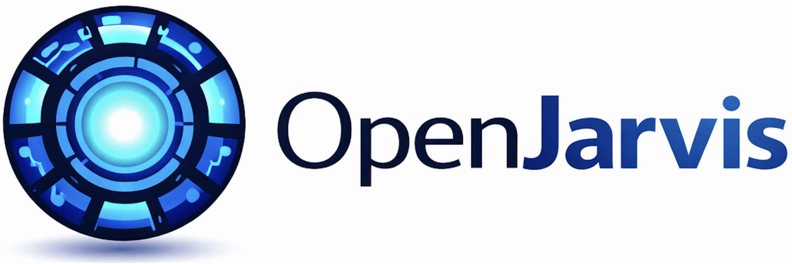

<div align="center">
  

  <p><i>Personal AI, On Personal Devices.</i></p>

  <p>
    <a href="https://www.intelligence-per-watt.ai/"></a>
    <a href="https://open-jarvis.github.io/OpenJarvis/"></a>
    
    
  </p>
</div>

---

> **[Documentation](https://open-jarvis.github.io/OpenJarvis/)**
>
> **[Project Site](https://www.intelligence-per-watt.ai/)** 
>
> **[Leaderboard](https://open-jarvis.github.io/OpenJarvis/leaderboard/)**

## Why OpenJarvis?

Personal AI agents are exploding in popularity, but nearly all of them still route intelligence through cloud APIs. Your "personal" AI continues to depend on someone else's server. At the same time, our [Intelligence Per Watt](https://www.intelligence-per-watt.ai/) research showed that local language models already handle 88.7% of single-turn chat and reasoning queries, with intelligence efficiency improving 5.3× from 2023 to 2025. The models and hardware are increasingly ready. What has been missing is the software stack to make local-first personal AI practical.

OpenJarvis is that stack. It is an opinionated framework for local-first personal AI, built around three core ideas: shared primitives for building on-device agents; evaluations that treat energy, FLOPs, latency, and dollar cost as first-class constraints alongside accuracy; and a learning loop that improves models using local trace data. The goal is simple: make it possible to build personal AI agents that run locally by default, calling the cloud only when truly necessary. OpenJarvis aims to be both a research platform and a production foundation for local AI, in the spirit of PyTorch.

## Installation

```bash
git clone https://github.com/open-jarvis/OpenJarvis.git
cd OpenJarvis
uv sync                           # core framework
uv sync --extra server             # + FastAPI server
```

You also need a local inference backend: [Ollama](https://ollama.com), [vLLM](https://github.com/vllm-project/vllm), [SGLang](https://github.com/sgl-project/sglang), or [llama.cpp](https://github.com/ggerganov/llama.cpp).

## Quick Start

The fastest path is Ollama on any machine with Python 3.10+:

```bash
# 1. Install OpenJarvis
git clone https://github.com/open-jarvis/OpenJarvis.git
cd OpenJarvis
uv sync

# 2. Detect hardware and generate config
uv run jarvis init

# 3. Install and start Ollama (https://ollama.com)
curl -fsSL https://ollama.com/install.sh | sh
ollama serve                      # start the Ollama server

# 4. Pull a model
ollama pull qwen3:8b

# 5. Ask a question
uv run jarvis ask "What is the capital of France?"

# 6. Verify your setup
uv run jarvis doctor
```

`jarvis init` auto-detects your hardware and recommends the best engine. After init, it prints engine-specific next steps. Run `uv run jarvis doctor` at any time to diagnose configuration or connectivity issues.

## Development

From source, you need to make sure Rust is installed on System:

```bash
curl --proto '=https' --tlsv1.2 -sSf https://sh.rustup.rs | sh
```

Then, you need the Rust extension for full functionality (security, tools, agents, etc.):

```bash
# 1. Clone and install Python deps
git clone https://github.com/open-jarvis/OpenJarvis.git
cd OpenJarvis
uv sync --extra dev

# 2. Build and install the Rust extension (requires Rust toolchain)
uv run maturin develop -m rust/crates/openjarvis-python/Cargo.toml

# 3. Run tests
uv run pytest tests/ -v
```

See [Contributing](docs/development/contributing.md) for more.

## About

OpenJarvis is part of [Intelligence Per Watt](https://www.intelligence-per-watt.ai/), a research initiative studying the efficiency of on-device AI systems. The project is developed at [Hazy Research](https://hazyresearch.stanford.edu/) and the [Scaling Intelligence Lab](https://scalingintelligence.stanford.edu/) at [Stanford SAIL](https://ai.stanford.edu/).

## Sponsors

<p>
  <a href="https://www.laude.org/">Laude Institute</a> &bull;
  <a href="https://datascience.stanford.edu/marlowe">Stanford Marlowe</a> &bull;
  <a href="https://cloud.google.com/">Google Cloud Platform</a> &bull;
  <a href="https://lambda.ai/">Lambda Labs</a> &bull;
  <a href="https://ollama.com/">Ollama</a> &bull;
  <a href="https://research.ibm.com/">IBM Research</a> &bull;
  <a href="https://hai.stanford.edu/">Stanford HAI</a>
</p>

## License

[Apache 2.0](LICENSE)
