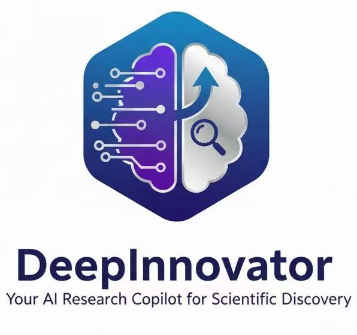
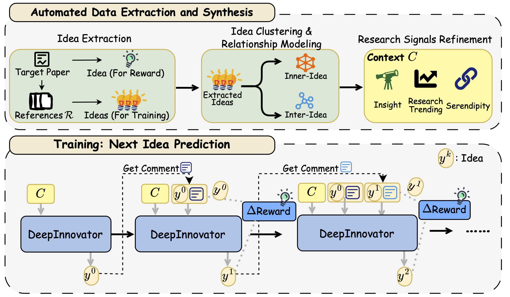

<div align="center">
  <picture>
      
  </picture>
</div>

<div align="center">

## DeepInnovator：你的科研创新 AI 搭档

| 💡 **生成科研创意与假设** | 🔗 **挖掘跨学科关联与融合机会** | <br>
| 🔍 **研究空白与趋势分析** | 🛠️ **面向科学问题的智能求解** |

[](https://huggingface.co/datasets/T1anyu/DeepInnovator)
[](https://huggingface.co/T1anyu/DeepInnovator)
[](https://arxiv.org/abs/2602.18920)
<a href="https://github.com/HKUDS/.github/blob/main/profile/README.md"></a>
<a href="https://github.com/HKUDS/.github/blob/main/profile/README.md"></a>
</div>

🔬 **DeepInnovator 是一个面向科研场景的 AI 研究助手**，基于我们构建的科学基础模型，专门为「科研创新」任务进行优化与训练。

💡 **DeepInnovator 旨在重塑科研人员获取灵感、提出想法与规划研究路径的方式**，帮助研究者系统性地发现突破性研究机会。

---

## 🧠 DeepInnovator 的核心能力

### 1. 💡 科研创意生成器
- 自动生成具有前沿性和研究价值的科研想法与研究方向
- 主动识别各科研领域中尚未被充分探索的空白与机会

### 2. 🔗 跨学科创新引擎
- 从多学科文献中抽取关键概念，挖掘潜在的跨域融合点
- 促进物理、计算机、教育、生物技术等领域之间的交叉创新

### 3. ❓ 科学问题与假设构建
- 构造符合学术规范且可检验的科学问题
- 生成可操作的研究假设，并给出潜在实验或研究设计思路

### 4. 📊 研究空白与趋势分析
- 识别现有研究中的局限、不足与遗漏点
- 预测领域发展趋势与新兴研究方向，辅助科研选题与规划

### 5. ⚙️ 创新方法论框架
- **“站在巨人的肩膀上”**：将海量文献转化为结构化科研记忆与可复用知识
- **“猜想与反驳”**：通过迭代式「下一个想法预测」机制不断改进科研创意

### 6. 🎯 创造性科研求解助手
- 针对复杂科研问题给出多视角、多路径的解决方案
- 辅助科研人员进行研究策略规划与资源配置决策

---

## 🚀 DeepInnovator 的效果表现

### 强基线模型上的显著提升
- DeepInnovator-14B 在所有评估维度上均显著优于 Qwen-14B-Instruct 基线模型
- 在自动评测中，相较未训练基线模型取得 **80.53%–93.81%** 的胜率

### 与顶级大模型（GPT-4o、Gemini-2.5-pro）具备竞争力
- 在参数量更小的前提下，DeepInnovator 在多个科研相关任务上接近甚至对标 GPT-4o 与 Gemini-2.5-pro
- 在「推理过程合理性」评估中，DeepInnovator 取得 **82.3%**，优于 GPT-4o 的 **77.9%**

### 出色的跨领域泛化能力
- 即便在训练中未直接覆盖的领域（如法学、教育、生物技术），依然展现出强零样本迁移能力
- 能够在多种不同学科中生成高质量的科研想法与问题设定

下表展示了人类专家对 DeepInnovator-14B 与 Qwen2.5-14B-IT 和 GPT-4o 在不同领域和指标上的比较标注：

| 领域 | 指标 | 大幅提升 | 提升 | 下降 | 大幅下降 | 均差 | 平均胜率 (vs Qwen-14B-IT / vs GPT-4o) |
|:------:|:------:|:-----------:|:------:|:-----:|:----------:|:--------:|:-----------------------------------:|
| **法学** | 新颖性 | 0 / 0 | 9 / 7 | 3 / 6 | 1 / 0 | 0 / 0 | **69.2%** / **53.8%** |
| | 可行性 | 1 / 0 | 5 / 4 | 3 / 7 | 1 / 1 | 3 / 1 | **60.0%** / 33.3% |
| | 有效性 | 2 / 1 | 5 / 4 | 2 / 3 | 1 / 3 | 3 / 2 | **70.0%** / 45.5% |
| | 详细性 | 7 / 1 | 3 / 4 | 2 / 5 | 1 / 0 | 0 / 3 | **76.9%** / 50.0% |
| **教育** | 新颖性 | 3 / 0 | 9 / 9 | 2 / 5 | 1 / 1 | 0 / 0 | **80.0%** / **60.0%** |
| | 可行性 | 3 / 0 | 5 / 0 | 5 / 7 | 1 / 3 | 1 / 5 | **57.1%** / 0.0% |
| | 有效性 | 2 / 0 | 6 / 0 | 4 / 5 | 3 / 4 | 0 / 6 | **53.3%** / 0.0% |
| | 详细性 | 1 / 0 | 8 / 4 | 3 / 5 | 0 / 2 | 3 / 4 | **75.0%** / 36.4% |
| **生物技术** | 新颖性 | 3 / 2 | 8 / 6 | 1 / 5 | 0 / 0 | 2 / 2 | **91.7%** / **61.5%** |
| | 可行性 | 2 / 0 | 6 / 5 | 0 / 3 | 0 / 5 | 6 / 2 | **100.0%** / 38.5% |
| | 有效性 | 1 / 2 | 6 / 5 | 4 / 2 | 1 / 4 | 2 / 2 | **58.3%** / **53.8%** |
| | 详细性 | 6 / 3 | 4 / 2 | 1 / 4 | 0 / 5 | 3 / 1 | **90.9%** / 35.7% |

- DeepInnovator-14B 在 **生物技术可行性** 上对 Qwen2.5-14B-IT 达到 **100% 胜率**
- 在 **生物技术新颖性** 上取得 **91.7%** 的优势表现
- 在 **生物技术详细性** 上取得 **90.9%** 的胜率
- 在与 GPT-4o 的比较中，依然在 **生物技术新颖性（61.5%）** 与 **教育新颖性（60.0%）** 上展现出优势

---

## 🏗️ 系统架构



DeepInnovator 包含三个主要技术组件：

1. **数据准备流水线**：从 arXiv 下载论文，提取结构化科研知识，通过多层分析流程生成训练数据
2. **奖励系统**：使用多个指标（增量奖励、token 数量等）评估想法质量
3. **强化学习训练**：使用 VERL 框架结合 GRPO（Group Relative Policy Optimization）算法训练智能体迭代改进研究想法

---

## 项目结构

```
DeepInnovator/
├── recipe/
│   └── DeepInnovator/
│       ├── data_preparation/      # 数据准备流水线
│       │   ├── config/           # Agent 和模型配置
│       │   ├── data_prepare/     # 流水线脚本
│       │   ├── run.sh           # 快速运行脚本
│       │   └── README.md        # 数据准备文档
│       ├── config/               # 训练配置
│       │   ├── agent.yaml       # Agent 循环配置
│       │   ├── reward_config.yaml  # 奖励函数配置
│       │   └── ResearchGAN_interaction_config.yaml  # 交互配置
│       ├── metrics/              # 奖励指标
│       │   ├── basic_reward.py
│       │   ├── delta_reward.py
│       │   └── token_amount.py
│       ├── preprocess.py        # 数据集预处理脚本
│       ├── preprocess.sh        # 预处理脚本运行器
│       ├── reward_function.py   # 主奖励函数
│       ├── DeepInnovator_interation.py  # 交互逻辑
│       ├── DeepInnovator_agent_loop.py  # Agent 循环实现
│       ├── train_rl.sh          # 训练脚本
│       └── utils.py             # 工具函数
└── verl/                        # VERL 框架（用于强化学习训练）
```

---

## 环境要求

- Python 3.8+
- 支持 CUDA 的 GPU（用于训练）
- VERL 框架（用于强化学习训练）
- 必需的 Python 包（见安装部分）

---

## 环境配置

### 1. 安装依赖

```bash
# 核心依赖
pip install openai omegaconf python-dotenv feedparser requests PyPDF2 tqdm python-dateutil
pip install datasets numpy torch transformers
```

### 2. 配置环境变量

在项目根目录创建 `.env` 文件：

```bash
# 数据准备的 API 配置
OPENAI_API_BASE=your_api_base_url
OPENAI_API_KEY=your_api_key

# 训练配置（如需要）
WANDB_API_KEY=your_wandb_api_key
WANDB_BASE_URL=your_wandb_base_url
```

### 3. 配置模型设置

编辑 `recipe/DeepInnovator/data_preparation/config/models/providers.yaml` 设置 API 端点：

```yaml
openai:
  base_url: ${env:OPENAI_API_BASE}
  api_key: ${env:OPENAI_API_KEY}
```

---

## 数据准备

数据准备流水线通过多个阶段处理学术论文以生成训练数据。

### 快速开始

运行完整流水线：

```bash
cd recipe/DeepInnovator/data_preparation
bash run.sh [total_papers] [datapath]
```

示例：

```bash
cd recipe/DeepInnovator/data_preparation
bash run.sh 100 ./data/arxiv_data
```

### 分步流程

#### 步骤 1：下载论文

从 arXiv 下载预定义类别（cs、stat、q-fin、math）的论文：

```bash
cd recipe/DeepInnovator/data_preparation
python data_prepare/pull_papers.py --total_papers 100 --datapath ./data/arxiv_data
```

**参数：**
- `--total_papers`: 要下载的论文总数
- `--datapath`: 数据保存路径

**输出：** 论文保存到 `{datapath}/raw_paper/` 目录

#### 步骤 2：提取目标论文想法

从目标论文中提取想法：

```bash
cd recipe/DeepInnovator/data_preparation
python data_prepare/get_target_paper_idea.py --datapath ./data/arxiv_data
```

**输出：** `{datapath}/{paper_id}/target_paper/raw_paper/paper_idea.json`

#### 步骤 3：生成训练数据

通过完整流水线（step1–step4）处理论文以生成训练数据：

```bash
cd recipe/DeepInnovator/data_preparation
python data_prepare/get_training_data.py
```

**输出结构：**
- `layer0/`: 论文分析结果
- `layer1/`: 论文分组和记忆
- `layer2/`: 连接、意外发现和趋势
- `insights/`: 生成的研究想法

### 数据预处理

生成训练数据后，为强化学习训练进行预处理：

```bash
cd recipe/DeepInnovator
python preprocess.py \
    --input_dir ./data/arxiv_data \
    --output_dir ./data/train \
    --task_desc "refine a research idea" \
    --validation_size 0.1 \
    --seed 42 \
    --num_proc 1 \
    --dataset_type "rl" \
    --test False \
    --layer0 False \
    --layer1 False \
    --layer2 True
```

**参数：**
- `--input_dir`: 包含已处理论文的输入目录
- `--output_dir`: 预处理数据的输出目录
- `--task_desc`: 数据集的任务描述
- `--validation_size`: 验证集比例（默认：0.1）
- `--seed`: 随机种子（默认：42）
- `--num_proc`: 并行工作进程数（默认：1）
- `--dataset_type`: 数据集类型 - "rl" 或 "sft"（默认："rl"）
- `--test`: 测试模式 - 采样固定数量的样本（默认：True）
- `--layer0/1/2`: 在提示中包含层级数据（默认：False）

**输出：** 
- `rl_train.parquet`: 训练数据集
- `rl_validation.parquet`: 验证数据集

或使用便捷脚本：

```bash
cd recipe/DeepInnovator
bash preprocess.sh
```

---

## 训练

### 配置

训练前，配置以下文件：

1. **`recipe/DeepInnovator/config/reward_config.yaml`**：配置奖励函数参数
   ```yaml
   config:
     metric_weights:
       delta_reward: 5
       token_amount: 0.1
     default_reward_kwargs:
       model: "your model"
       api_key: "your api key"
       api_base: "your api base"
   ```

2. **`recipe/DeepInnovator/config/ResearchGAN_interaction_config.yaml`**：配置交互设置
   ```yaml
   interaction:
     - name: "DeepInnovator"
       discriminator_kwargs:
         discriminator_model: "your model"
         api_key: "your api key"
         api_base: "your api base"
   ```

3. **`recipe/DeepInnovator/train_rl.sh`**：更新训练参数
   - `MODEL_DIR`: 基础模型路径
   - `DATASET_DIR`: 预处理数据集路径
   - `WANDB_PROJECT_NAME`: Weights & Biases 项目名称
   - `WANDB_EXPERIMENT_NAME`: 实验名称
   - GPU 设置、批次大小等

### 开始训练

```bash
cd recipe/DeepInnovator
bash train_rl.sh [resume_path]
```

**参数：**
- `resume_path`（可选）：要恢复的检查点路径

**训练配置：**
- 基础模型：Qwen2.5-14B-IT
- 算法：GRPO（Group Relative Policy Optimization）
- 多轮交互：最多 5 轮用户回合，6 轮助手回合
- 奖励：delta_reward 和 token_amount 指标的组合
- 训练轮数：3
- 批次大小：16（训练），4（PPO 小批次）

### 训练流程

训练过程包括：

1. **Agent 循环**：迭代生成研究想法
2. **判别器**：评估想法真实性（真实 vs 虚构）
3. **奖励计算**：基于以下指标计算奖励：
   - delta_reward：迭代间的改进
   - token_amount：基于长度的奖励
4. **策略更新**：使用 PPO 算法更新智能体策略

---

## 核心组件

### 奖励函数（`recipe/DeepInnovator/reward_function.py`）

通过组合多个指标计算对话级奖励：
- `delta_reward`：测量迭代间的改进
- `token_amount`：基于长度的奖励
- 通过 `reward_config.yaml` 配置权重

### 交互（`recipe/DeepInnovator/DeepInnovator_interation.py`）

实现交互逻辑：
- 从智能体响应中提取想法
- 使用判别器评估真实性
- 管理多轮对话
- 处理终止条件

### Agent 循环（`recipe/DeepInnovator/DeepInnovator_agent_loop.py`）

管理智能体的决策过程：
- 处理用户提示
- 生成响应
- 处理多轮交互
- 管理智能体状态

---

## 输出结构

数据准备后：

```
data/
└── {paper_id}/
    ├── target_paper/          # 目标论文和参考文献
    │   └── raw_paper/
    │       ├── paper_md/      # Markdown 文件
    │       └── paper_idea.json  # 提取的想法
    ├── raw_paper/             # 原始下载的论文
    ├── layer0/                # 论文分析
    │   └── paper_memory/      # 结构化论文数据
    ├── layer1/                # 论文分组
    │   ├── inner_paper_memory.json
    │   └── inter_paper_group.json
    ├── layer2/                # 连接和洞察
    │   ├── connections.json
    │   ├── serendipity.json
    │   └── research_trending.json
    └── insights/              # 生成的想法
        └── idea_spark.json
```

预处理后：

```
data/train/
├── rl_train.parquet          # 训练数据集
└── rl_validation.parquet     # 验证数据集
```

---

## 许可证

本项目基于 MIT 许可证开源 - 详见 [LICENSE](LICENSE) 文件。

---

## 🌟 Citation

```python
@article{fan2026deepinnovator,
  title={DeepInnovator: Triggering the Innovative Capabilities of LLMs},
  author={Fan, Tianyu and Zhang, Fengji and Zheng, Yuxiang and Chen, Bei and Niu, Xinyao and Huang, Chengen and Lin, Junyang and Huang, Chao},
  journal={arXiv preprint arXiv:2602.18920},
  year={2026}
}
```

<div align="center">
如果你觉得 DeepInnovator 对你的研究有帮助，欢迎为我们点亮一颗小星星 ⭐
</div>

<p align="center">
  <em>感谢你关注 ✨ DeepInnovator！</em><br><br>
  
</p>

