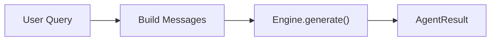
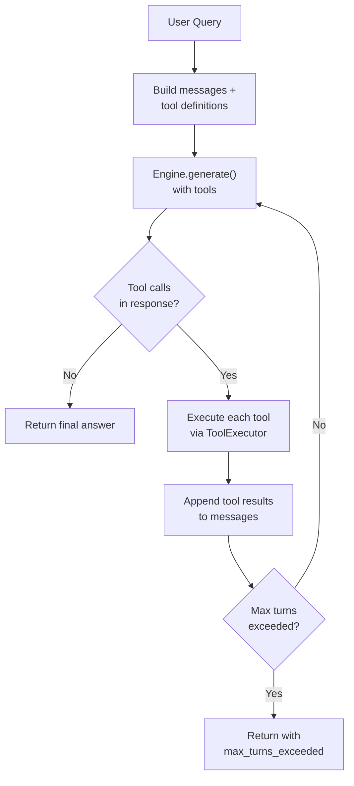
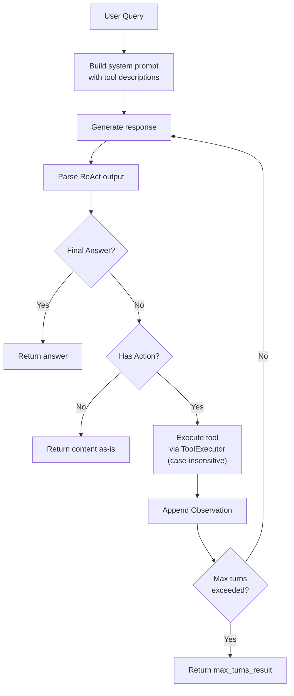
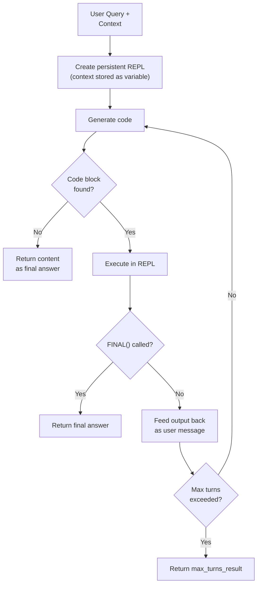
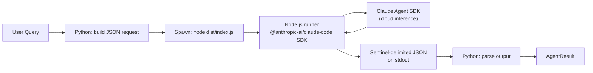
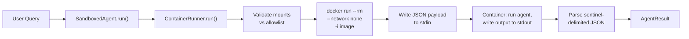

# Agentic Logic Primitive

The Agentic Logic primitive provides **pluggable agents** that handle queries with varying levels of sophistication -- from simple single-turn responses to multi-turn tool-calling loops, ReAct-style reasoning, CodeAct code execution, recursive decomposition, and external agent communication.

---

## BaseAgent ABC

All agents implement the `BaseAgent` abstract base class, which provides both the `run()` contract and concrete helper methods that eliminate boilerplate in subclasses:

```python
class BaseAgent(ABC):
    agent_id: str
    accepts_tools: bool = False  # overridden by ToolUsingAgent

    def __init__(
        self,
        engine: InferenceEngine,
        model: str,
        *,
        bus: Optional[EventBus] = None,
        temperature: float = 0.7,
        max_tokens: int = 1024,
    ) -> None: ...

    @abstractmethod
    def run(
        self,
        input: str,
        context: Optional[AgentContext] = None,
        **kwargs: Any,
    ) -> AgentResult:
        """Execute the agent on *input* and return an AgentResult."""
```

### Class Attribute: `accepts_tools`

The `accepts_tools` class attribute (default `False`) enables the CLI and SDK to auto-detect which agents support tool-passing. Agents that set `accepts_tools = True` can receive `--tools` on the CLI and `tools=` in the SDK.

### Concrete Helper Methods

`BaseAgent` provides five concrete helpers that subclasses use to avoid duplicating common logic:

| Helper | Purpose |
|--------|---------|
| `_emit_turn_start(input)` | Publish `AGENT_TURN_START` on the event bus |
| `_emit_turn_end(**data)` | Publish `AGENT_TURN_END` on the event bus |
| `_build_messages(input, context, *, system_prompt)` | Assemble the message list from optional system prompt, conversation context, and user input |
| `_generate(messages, **extra_kwargs)` | Call `engine.generate()` with stored defaults (model, temperature, max_tokens) |
| `_max_turns_result(tool_results, turns, content)` | Build the standard `AgentResult` for when `max_turns` is exceeded |
| `_strip_think_tags(text)` | Remove `<think>...</think>` blocks from model output (static method) |

### The `run()` Contract

The `run()` method is the single entry point for all agent implementations. It receives:

- **`input`** -- The user's query text
- **`context`** -- An optional `AgentContext` with conversation history, tool names, and memory results
- **`**kwargs`** -- Additional implementation-specific parameters

It returns an `AgentResult` containing the response content, any tool results, the number of turns taken, and metadata.

### Supporting Dataclasses

```python
@dataclass(slots=True)
class AgentContext:
    conversation: Conversation    # Prior messages for multi-turn context
    tools: List[str]              # Available tool names
    memory_results: List[Any]     # Pre-fetched memory search results
    metadata: Dict[str, Any]      # Arbitrary key-value pairs

@dataclass(slots=True)
class AgentResult:
    content: str                  # The agent's response text
    tool_results: List[ToolResult]  # Results from tool invocations
    turns: int                    # Number of inference turns taken
    metadata: Dict[str, Any]      # Arbitrary metadata
```

---

## ToolUsingAgent

`ToolUsingAgent` is an intermediate base class for agents that accept and use tools. It extends `BaseAgent` with:

- **`accepts_tools = True`** -- Enables CLI/SDK tool introspection
- **`ToolExecutor`** -- Initialized from the provided tool list, handles dispatch with JSON argument parsing, latency tracking, and event bus integration
- **`max_turns`** -- Configurable loop iteration limit (default: 10)

```python
class ToolUsingAgent(BaseAgent):
    accepts_tools: bool = True

    def __init__(
        self,
        engine: InferenceEngine,
        model: str,
        *,
        tools: Optional[List[BaseTool]] = None,
        bus: Optional[EventBus] = None,
        max_turns: int = 10,
        temperature: float = 0.7,
        max_tokens: int = 1024,
    ) -> None: ...
```

All tool-using agents (`OrchestratorAgent`, `NativeReActAgent`, `NativeOpenHandsAgent`, `RLMAgent`) extend this class.

!!! info "Agents that bypass ToolUsingAgent"
    Some agents extend `BaseAgent` directly and set `accepts_tools = False`: `SimpleAgent` (single-turn, no tools), `OpenHandsAgent` (tool management is handled by the openhands-sdk), and `ClaudeCodeAgent` (tools are managed by the Claude Agent SDK). `SandboxedAgent` also extends `BaseAgent` directly because it wraps another agent rather than calling tools itself.

---

## Choosing an Agent

Start here. Pick the simplest agent that handles your task — simpler agents are faster, use fewer tokens, and are easier to debug. Reach for more complex agents only when the task demands it.

| Use case | Agent | Why |
|---|---|---|
| Simple Q&A, single-turn | `simple` | No overhead, one inference call |
| Multi-step with tools (calculator, search, files) | `orchestrator` | Function-calling loop, most compatible with OpenAI-format models |
| Explicit reasoning chains | `native_react` | Thought-Action-Observation loop based on [ReAct (Yao et al., 2023)](https://arxiv.org/abs/2210.03629); reasoning traces are visible and debuggable |
| Code generation + execution | `native_openhands` | CodeAct pattern inspired by [OpenHands (Wang et al., 2024)](https://arxiv.org/abs/2407.16741); generates and executes Python inline |
| Long documents, recursive decomposition | `rlm` | Stores context in a persistent REPL, decomposes via recursive sub-LM calls |
| Untrusted inputs | `sandboxed` wrapping any agent | Container isolation with network disabled and mount allowlists |

**General guidance:** `orchestrator` is the default for most tool-using tasks. Use `native_react` when you want visible reasoning traces (e.g., for debugging or auditing agent behavior). Use `native_openhands` when the task involves writing and running code. Use `rlm` when context is too long to fit in a single prompt window.

---

## Agent Implementations

### SimpleAgent

**Registry key:** `simple`

The simplest agent implementation -- a single-turn, no-tool query-to-response pipeline. Extends `BaseAgent` directly (does not accept tools).



How it works:

1. Calls `_emit_turn_start()` to publish `AGENT_TURN_START` on the event bus
2. Calls `_build_messages()` to assemble the message list from conversation context plus user input
3. Calls `_generate()` to invoke the engine with stored defaults
4. Calls `_emit_turn_end()` and returns an `AgentResult` with `turns=1`

```python
from openjarvis.agents.simple import SimpleAgent

agent = SimpleAgent(engine, model="qwen3:8b", bus=bus)
result = agent.run("What is the capital of France?")
print(result.content)  # "The capital of France is Paris."
```

### OrchestratorAgent

**Registry key:** `orchestrator`

A multi-turn agent that implements a **tool-calling loop**. Extends `ToolUsingAgent`. The LLM can request tool invocations, and the results are fed back for further processing until the model produces a final text response.

Supports two modes:

- **`function_calling`** (default) -- Uses OpenAI function-calling format via `ToolExecutor.get_openai_tools()`
- **`structured`** -- Uses structured output format for models that support it



How it works:

1. Builds initial messages from context and user input
2. Converts available tools to OpenAI function-calling format via `ToolExecutor.get_openai_tools()`
3. Enters a loop (up to `max_turns` iterations):
    - Calls `engine.generate()` with messages and tool definitions
    - If the response contains `tool_calls`, executes each tool and appends the results as `TOOL` messages
    - If no `tool_calls` are present, returns the content as the final answer
4. If `max_turns` is exceeded, returns the last content or a warning message

```python
from openjarvis.agents.orchestrator import OrchestratorAgent
from openjarvis.tools.calculator import CalculatorTool
from openjarvis.tools.think import ThinkTool

agent = OrchestratorAgent(
    engine,
    model="qwen3:8b",
    tools=[CalculatorTool(), ThinkTool()],
    bus=bus,
    max_turns=10,
)
result = agent.run("What is 2^10 + 3^5?")
# The agent may call the calculator tool, get "1267", then respond
```

### NativeReActAgent

**Registry key:** `native_react` (alias: `react`)

A ReAct (Reasoning + Acting) agent that implements a **Thought-Action-Observation** loop. Extends `ToolUsingAgent`. The LLM is prompted to output structured text with `Thought:`, `Action:`, `Action Input:`, and `Final Answer:` fields, which the agent parses to drive tool execution.



How it works:

1. Builds a system prompt with enriched tool descriptions via `build_tool_descriptions()`. Parsing is case-insensitive.
2. Generates a response and parses the ReAct-structured output
3. If a `Final Answer:` is found, returns it
4. If an `Action:` is found, executes the tool and feeds the result back as an `Observation:`
5. Loops until a final answer is produced or `max_turns` is exceeded

!!! note "Backward compatibility"
    The old `from openjarvis.agents.react import ReActAgent` import path still works via a backward-compat shim. The registry alias `"react"` also maps to `NativeReActAgent`.

```python
from openjarvis.agents.native_react import NativeReActAgent

agent = NativeReActAgent(
    engine,
    model="qwen3:8b",
    tools=[CalculatorTool(), ThinkTool()],
    max_turns=10,
)
result = agent.run("What is the square root of 256?")
```

### NativeOpenHandsAgent

**Registry key:** `native_openhands`

A CodeAct-style agent that generates and executes Python code. Extends `ToolUsingAgent`. It can also invoke tools via structured `Action:` / `Action Input:` output. URLs in the input are automatically pre-fetched and inlined for the LLM.

How it works:

1. Builds a detailed system prompt with enriched tool descriptions (via shared `build_tool_descriptions()` builder) and code execution instructions
2. Pre-fetches any URLs in the user input, inlining the content directly
3. For each turn:
    - Generates a response and strips `<think>` tags
    - If a `\`\`\`python` code block is found, executes it via `code_interpreter`
    - If an `Action:` / `Action Input:` is found, dispatches the tool
    - If neither is found, returns the content as the final answer
4. Handles context window overflow with automatic truncation

```python
from openjarvis.agents.native_openhands import NativeOpenHandsAgent

agent = NativeOpenHandsAgent(
    engine,
    model="qwen3:8b",
    tools=[CalculatorTool(), WebSearchTool()],
    max_turns=3,
    max_tokens=2048,
)
result = agent.run("Summarize https://example.com/article")
```

### RLMAgent

**Registry key:** `rlm`

A Recursive Language Model agent based on the [RLM paper](https://arxiv.org/abs/2512.24601). Instead of passing long context directly in the LLM prompt, RLM stores context as a Python variable in a persistent REPL. A "Root LM" writes Python code to inspect, decompose, and process context using recursive sub-LM calls via `llm_query()` and `llm_batch()`. Extends `ToolUsingAgent`.



How it works:

1. Creates a persistent REPL with `llm_query()` and `llm_batch()` callbacks. Tool descriptions are injected via the shared `build_tool_descriptions()` builder when tools are provided.
2. Injects context from `AgentContext` metadata or memory results into the REPL as a variable
3. Generates code and executes it in the REPL
4. If `FINAL(value)` or `FINAL_VAR("name")` is called, returns the final answer
5. If no code block is found, treats the content as a direct answer

The agent supports configurable sub-model parameters for recursive calls:

| Parameter | Default | Description |
|-----------|---------|-------------|
| `sub_model` | same as `model` | Model for sub-LM calls |
| `sub_temperature` | `0.3` | Temperature for sub-LM calls |
| `sub_max_tokens` | `1024` | Max tokens for sub-LM calls |
| `max_output_chars` | `10000` | Max REPL output characters |
| `system_prompt` | `RLM_SYSTEM_PROMPT` | Override the system prompt |

```python
from openjarvis.agents.rlm import RLMAgent

agent = RLMAgent(
    engine,
    model="qwen3:8b",
    max_turns=10,
    sub_model="qwen3:1.7b",  # smaller model for sub-queries
    sub_temperature=0.3,
)
result = agent.run("Summarize this document", context=ctx)
```

### OpenHandsAgent (SDK)

**Registry key:** `openhands`

A thin wrapper around the real `openhands-sdk` package for AI-driven software development tasks. Extends `BaseAgent` directly (does not use `ToolUsingAgent` since tool management is handled by the SDK).

!!! warning "Optional dependency"
    This agent requires the `openhands-sdk` package (`uv sync --extra openhands`). The SDK requires Python 3.12+.

How it works:

1. Imports `openhands.sdk` at runtime (lazy import)
2. Creates an LLM, Agent, and Conversation from the SDK
3. Sends the user input as a message and runs the conversation
4. Extracts the final message content from the conversation

```python
from openjarvis.agents.openhands import OpenHandsAgent

agent = OpenHandsAgent(
    engine,
    model="gpt-4",
    workspace="/path/to/project",
    api_key="sk-...",
)
result = agent.run("Fix the failing test in test_utils.py")
```

### ClaudeCodeAgent

**Registry key:** `claude_code`

Wraps the `@anthropic-ai/claude-code` SDK via a bundled Node.js subprocess bridge. Unlike every other agent, inference is handled entirely by the Claude Agent SDK -- the OpenJarvis inference engine is not used. This makes `ClaudeCodeAgent` a true external agent, similar in spirit to `OpenHandsAgent` but implemented via subprocess rather than an importable Python SDK.



How it works:

1. On first call, copies the bundled `claude_code_runner/` to `~/.openjarvis/claude_code_runner/` and runs `npm install --production` if `node_modules` is absent
2. Builds a JSON request with `prompt`, `api_key`, `workspace`, `allowed_tools`, `system_prompt`, and `session_id`
3. Spawns `node dist/index.js` and writes the request to stdin
4. Reads stdout and extracts the JSON payload between `---OPENJARVIS_OUTPUT_START---` and `---OPENJARVIS_OUTPUT_END---` sentinels
5. Falls back to treating all stdout as plain text content if sentinels are absent

!!! warning "Requires Node.js 22+"
    `ClaudeCodeAgent` raises `RuntimeError` at `run()` time if `node` is not found on `PATH`. An `ANTHROPIC_API_KEY` environment variable is required for the Claude Agent SDK to authenticate.

```python
from openjarvis.agents.claude_code import ClaudeCodeAgent

agent = ClaudeCodeAgent(
    engine=None,   # not used
    model="",      # not used
    workspace="/path/to/project",
    timeout=120,
)
result = agent.run("Add type hints to all functions in utils.py")
```

### SandboxedAgent and ContainerRunner

`SandboxedAgent` and `ContainerRunner` together implement **container-isolated agent execution** following the `GuardrailsEngine` wrapper pattern. `SandboxedAgent` wraps any `BaseAgent` and delegates execution to a Docker (or Podman) container managed by `ContainerRunner`.



**ContainerRunner** manages the full container lifecycle:

- Validates mount paths against a `MountAllowlist` before container start (raises `ValueError` for blocked or out-of-root paths)
- Constructs `docker run --rm --network none -i <image>` with validated read-only bind mounts
- Sends a JSON payload to container stdin (prompt, agent ID, model, and optional secrets)
- Reads stdout and parses sentinel-delimited JSON output
- On timeout, force-kills the container via `docker rm -f`
- `cleanup_orphans()` removes any stale containers labelled `openjarvis-sandbox=true`

**Mount security** (`sandbox/mount_security.py`) enforces two independent checks on every mount path:

1. **Blocked patterns:** Path components are matched against `DEFAULT_BLOCKED_PATTERNS` (`.ssh`, `.env`, `*.pem`, `*.key`, cloud configs, etc.). A match raises `ValueError`.
2. **Allowed roots:** If `roots` are configured in the allowlist, the resolved path must be under one of them. An empty `roots` list allows any non-blocked path.

```python
from openjarvis.sandbox import ContainerRunner, SandboxedAgent

runner = ContainerRunner(
    image="openjarvis-sandbox:latest",
    timeout=60,
    runtime="docker",
)
# Wrap any BaseAgent
inner = SimpleAgent(engine, model="qwen3:8b")
sandboxed = SandboxedAgent(
    agent=inner,
    runner=runner,
    mounts=["/home/user/data"],
)
result = sandboxed.run("Summarize the reports in /home/user/data")
```

!!! warning "accepts_tools = False"
    `SandboxedAgent` does not accept tools via `--tools` or `tools=`. Tool calling within the sandbox is the responsibility of the wrapped inner agent.

---

## Tool System Integration

All `ToolUsingAgent` subclasses use the `ToolExecutor` to dispatch tool calls. The tool system is built on the `BaseTool` ABC:

```python
class BaseTool(ABC):
    tool_id: str

    @property
    @abstractmethod
    def spec(self) -> ToolSpec:
        """Return the tool specification."""

    @abstractmethod
    def execute(self, **params: Any) -> ToolResult:
        """Execute the tool with the given parameters."""

    def to_openai_function(self) -> Dict[str, Any]:
        """Convert to OpenAI function-calling format."""
```

### Built-in Tools

| Tool | Registry Key | Description |
|------|-------------|-------------|
| `CalculatorTool` | `calculator` | AST-based safe expression evaluator |
| `ThinkTool` | `think` | Reasoning scratchpad (returns input as-is) |
| `RetrievalTool` | `retrieval` | Memory search via a memory backend |
| `LLMTool` | `llm` | Sub-model calls (query a different model) |
| `FileReadTool` | `file_read` | Safe file reading with path validation |

### ToolExecutor

The `ToolExecutor` handles tool dispatch with JSON argument parsing, latency tracking, and event bus integration:

```python
class ToolExecutor:
    def __init__(self, tools: List[BaseTool], bus: Optional[EventBus] = None):
        self._tools = {t.spec.name: t for t in tools}
        self._bus = bus

    def execute(self, tool_call: ToolCall) -> ToolResult:
        """Parse arguments, dispatch to tool, measure latency, emit events."""

    def get_openai_tools(self) -> List[Dict[str, Any]]:
        """Return tools in OpenAI function-calling format."""
```

For each tool call:

1. Looks up the tool by name
2. Parses the JSON arguments string
3. Publishes `TOOL_CALL_START` on the event bus
4. Executes the tool with timing
5. Publishes `TOOL_CALL_END` with success status and latency
6. Returns the `ToolResult`

---

## Event Bus Integration

All agents integrate with the `EventBus` for telemetry and trace collection:

| Event | Published By | When |
|-------|-------------|------|
| `AGENT_TURN_START` | All agents (via `_emit_turn_start` helper) | Before starting query processing |
| `AGENT_TURN_END` | All agents (via `_emit_turn_end` helper) | After producing a response |
| `TOOL_CALL_START` | ToolExecutor (all `ToolUsingAgent` subclasses) | Before executing a tool |
| `TOOL_CALL_END` | ToolExecutor (all `ToolUsingAgent` subclasses) | After executing a tool |

!!! info "Inference events"
    `INFERENCE_START` and `INFERENCE_END` events are published by the `InstrumentedEngine` wrapper (in `telemetry/instrumented_engine.py`), not by agents directly. This keeps telemetry opt-in and transparent to agent code.

These events are consumed by the `TelemetryStore` (for metrics) and `TraceCollector` (for interaction traces).

---

## Agent Registration

Agents are registered via the `@AgentRegistry.register("name")` decorator:

```python
from openjarvis.core.registry import AgentRegistry
from openjarvis.agents._stubs import BaseAgent

@AgentRegistry.register("my-agent")
class MyAgent(BaseAgent):
    agent_id = "my-agent"

    def run(self, input, context=None, **kwargs):
        ...
```

To list all registered agents:

```python
from openjarvis.core.registry import AgentRegistry

print(AgentRegistry.keys())
# ("simple", "orchestrator", "native_react", "react", "native_openhands", "rlm", "openhands")
```

To instantiate an agent by key:

```python
agent = AgentRegistry.create("orchestrator", engine, model, tools=tools, bus=bus)
```
