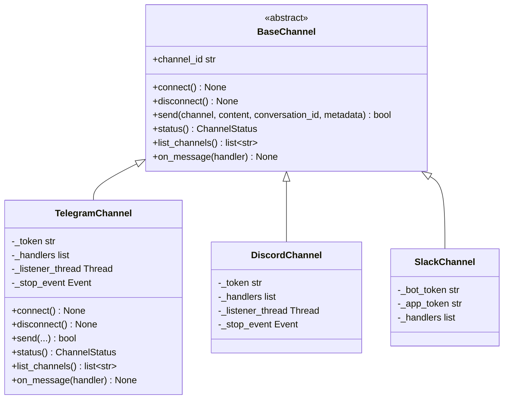
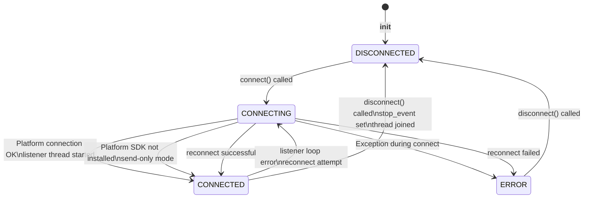
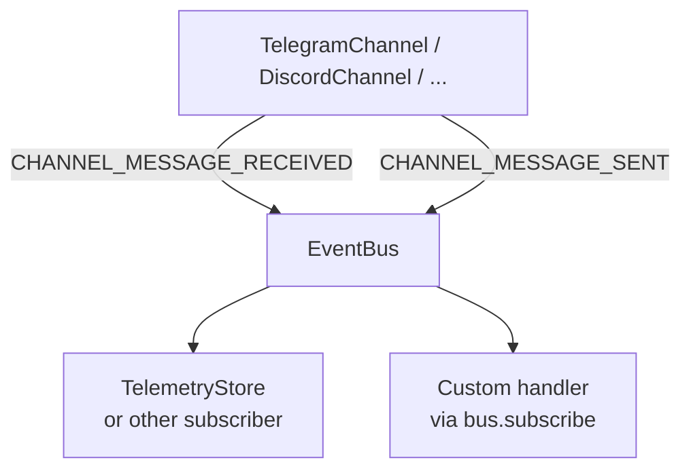

# Channels Architecture

The channels module provides a transport-agnostic messaging layer for receiving and sending messages through external platforms. The design follows the same registry-plus-ABC pattern used throughout OpenJarvis: a `BaseChannel` interface defines the contract, and concrete implementations for each platform (Telegram, Discord, Slack, WhatsApp, etc.) are registered for runtime discovery.

---

## Design Principles

- **Transport-agnostic ABC.** `BaseChannel` defines six abstract methods covering the full lifecycle: connect, disconnect, send, status, list channels, and message handler registration.
- **Direct platform integration.** Each channel connects directly to its platform API -- there is no intermediate gateway.
- **Background listener thread.** Incoming messages are delivered via a daemon thread, not an event loop, so channels work from synchronous code without requiring async infrastructure.
- **Registry-driven discovery.** All channel implementations self-register via `@ChannelRegistry.register("name")` and are discoverable at runtime.

---

## BaseChannel ABC



All `BaseChannel` subclasses must be registered via `@ChannelRegistry.register("name")` to be discoverable at runtime. For example, `TelegramChannel` is registered as `"telegram"`, `DiscordChannel` as `"discord"`, etc.

---

## Channel Lifecycle

The connection lifecycle for a typical channel implementation, from instantiation through to disconnection:



The `ChannelStatus` enum (`CONNECTED`, `DISCONNECTED`, `CONNECTING`, `ERROR`) tracks this state and is exposed via `status()`.

---

## Listener Loop Pattern

Most channel implementations use a background daemon thread for receiving messages. The pattern is consistent across channels:

1. The listener thread is started in `connect()`.
2. It polls or listens for messages from the platform API.
3. Incoming messages are parsed into `ChannelMessage` dataclass instances.
4. All registered handlers are called sequentially.
5. If an `EventBus` is provided, a `CHANNEL_MESSAGE_RECEIVED` event is published.
6. On disconnect or error, the thread handles reconnection or exits cleanly.

Handler exceptions are caught individually so that a failing handler does not prevent subsequent handlers from running:

```python
for handler in self._handlers:
    try:
        handler(msg)
    except Exception:
        logger.exception("Channel handler error")
```

---

## Event Flow

Channel events are published to the `EventBus` using two event types:

| Event | Published By | When | Payload |
|-------|-------------|------|---------|
| `CHANNEL_MESSAGE_RECEIVED` | Listener loop | Message received from platform | `channel`, `sender`, `content`, `message_id` |
| `CHANNEL_MESSAGE_SENT` | `send()` | Message successfully delivered | `channel`, `content`, `conversation_id` |

These events allow other modules to react to channel activity without depending on the channel implementation directly. For example, a logging subscriber can record all sent and received messages, or an agent can be wired to respond to incoming channel messages by subscribing to `CHANNEL_MESSAGE_RECEIVED`.



---

## Handler Registration

Multiple handlers can be registered. They are stored in a list and called sequentially within the listener thread. Returning a value from a handler has no effect on message routing -- the return type `Optional[str]` is reserved for future use (for example, auto-reply routing).

```python
# ChannelHandler type alias
ChannelHandler = Callable[[ChannelMessage], Optional[str]]
```

---

## Threading Model

Channel implementations use Python's `threading` module rather than asyncio. This is a deliberate choice: OpenJarvis's core inference path is synchronous, and daemon threads are simpler to compose with synchronous code than coroutines.

| Component | Thread | Notes |
|-----------|--------|-------|
| `connect()`, `send()`, `disconnect()` | Caller thread | All public methods are thread-safe |
| Listener loop | Background daemon thread | Started in `connect()`, joined in `disconnect()` |
| Handler callbacks | Background daemon thread | Called from listener thread -- use thread-safe data structures |

!!! warning "Handler thread safety"
    Handler callbacks run on the listener thread, not the thread that called `connect()`. If your handler modifies shared state, protect it with a lock or use thread-safe data structures such as `queue.Queue`.

---

## Adding a New Channel Backend

To add a new channel backend:

1. Create a new file in `src/openjarvis/channels/`.
2. Subclass `BaseChannel` and implement all six abstract methods.
3. Set `channel_id` as a class attribute.
4. Decorate with `@ChannelRegistry.register("name")`.
5. Add the module name to `_CHANNEL_MODULES` in `channels/__init__.py`.

```python
from openjarvis.channels._stubs import BaseChannel, ChannelMessage, ChannelStatus
from openjarvis.core.registry import ChannelRegistry

@ChannelRegistry.register("my_platform")
class MyPlatformChannel(BaseChannel):
    channel_id = "my_platform"

    def connect(self) -> None: ...
    def disconnect(self) -> None: ...
    def send(self, channel, content, *, conversation_id="", metadata=None) -> bool: ...
    def status(self) -> ChannelStatus: ...
    def list_channels(self) -> list[str]: ...
    def on_message(self, handler) -> None: ...
```

After registration, the backend is discoverable via `ChannelRegistry.get("my_platform")`.

---

## See Also

- [User Guide: Channels](../user-guide/channels.md) -- how to use channels in practice
- [API Reference: Channels](../api-reference/openjarvis/channels/index.md) -- complete class and type signatures
- [Architecture: Overview](overview.md) -- where channels fit in the overall system
- [Architecture: Design Principles](design-principles.md) -- registry pattern and ABC conventions
