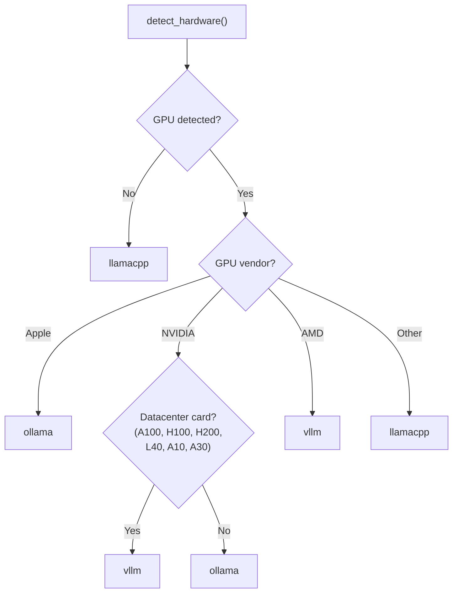

# Inference Engine Primitive

The Engine primitive provides the **inference runtime** -- the layer that connects OpenJarvis to language model servers. All backends implement a uniform interface, making it straightforward to swap between local and cloud inference without changing application code.

---

## InferenceEngine ABC

Every engine backend extends the `InferenceEngine` abstract base class:

```python
class InferenceEngine(ABC):
    engine_id: str

    @abstractmethod
    def generate(
        self,
        messages: Sequence[Message],
        *,
        model: str,
        temperature: float = 0.7,
        max_tokens: int = 1024,
        **kwargs: Any,
    ) -> Dict[str, Any]:
        """Synchronous completion -- returns a dict with 'content' and 'usage'."""

    @abstractmethod
    async def stream(
        self,
        messages: Sequence[Message],
        *,
        model: str,
        temperature: float = 0.7,
        max_tokens: int = 1024,
        **kwargs: Any,
    ) -> AsyncIterator[str]:
        """Yield token strings as they are generated."""

    @abstractmethod
    def list_models(self) -> List[str]:
        """Return identifiers of models available on this engine."""

    @abstractmethod
    def health(self) -> bool:
        """Return True when the engine is reachable and healthy."""

    def prepare(self, model: str) -> None:
        """Optional warm-up hook called before the first request."""
```

### Return Format

The `generate()` method returns a dictionary with the following structure:

```python
{
    "content": "The model's response text",
    "usage": {
        "prompt_tokens": 42,
        "completion_tokens": 128,
        "total_tokens": 170,
    },
    "model": "qwen3:8b",
    "finish_reason": "stop",
    "tool_calls": [...]  # Optional, present if model requested tool calls
}
```

When the model requests tool calls, they are extracted and passed through in OpenAI format:

```python
{
    "tool_calls": [
        {
            "id": "call_abc123",
            "name": "calculator",
            "arguments": "{\"expression\": \"2 + 2\"}"
        }
    ]
}
```

### Multi-Provider Tool Call Extraction

Engine backends normalize tool calls from different providers into the standard flat format used by agents:

| Provider | Source Format | Extraction Logic |
|----------|-------------|-----------------|
| **OpenAI** | `choices[0].message.tool_calls[].function.{name, arguments}` | Direct extraction, add `id` from `tool_calls[].id` |
| **Anthropic** | `content[]` blocks with `type: "tool_use"` | Filter `tool_use` blocks, map `input` dict to JSON `arguments` |
| **Google** | `candidates[0].content.parts[]` with `function_call` | Extract `function_call.name` and `function_call.args`, serialize args to JSON |
| **LiteLLM** | Flat `{id, name, arguments}` dicts (proxy pre-normalizes) | Pass through directly |
| **Ollama** | `message.tool_calls[].function.{name, arguments}` | Extract from Ollama native format, serialize arguments dict to JSON |

All providers produce the same output format consumed by agents:

```python
{
    "tool_calls": [
        {"id": "call_abc", "name": "calculator", "arguments": "{\"expression\": \"2+2\"}"}
    ]
}
```

---

## Backend Comparison

| Backend | Registry Key | Protocol | Default Port | GPU Required | Best For |
|---------|-------------|----------|-------------|-------------|----------|
| **Ollama** | `ollama` | Native HTTP API | 11434 | No (GPU optional) | Getting started, consumer GPUs, Apple Silicon |
| **vLLM** | `vllm` | OpenAI-compatible | 8000 | NVIDIA recommended | Datacenter GPUs (A100, H100), high throughput |
| **SGLang** | `sglang` | OpenAI-compatible | 30000 | NVIDIA recommended | Structured generation, speculative decoding |
| **llama.cpp** | `llamacpp` | OpenAI-compatible | 8080 | No (CPU-optimized) | CPU-only systems, GGUF models, edge devices |
| **MLX** | `mlx` | OpenAI-compatible | 8080 | Apple Silicon | Apple Silicon native inference via MLX |
| **LM Studio** | `lmstudio` | OpenAI-compatible | 1234 | No (GPU optional) | Desktop GUI, easy model management |
| **Exo** | `exo` | OpenAI-compatible | 52415 | No (distributed) | Distributed inference across heterogeneous devices |
| **Nexa** | `nexa` | OpenAI-compatible | 18181 | No (CPU/GPU) | On-device inference with GGUF models |
| **Uzu** | `uzu` | OpenAI-compatible | 8000 | Varies | Uzu inference runtime |
| **Apple FM** | `apple_fm` | OpenAI-compatible | 8079 | Apple Silicon | Apple Foundation Model on-device inference |
| **LiteLLM** | `litellm` | OpenAI-compatible | — | No | Unified proxy to 100+ LLM providers |
| **Cloud** | `cloud` | Provider SDKs | — | No | OpenAI, Anthropic, Google API access |

### Ollama

The Ollama backend communicates via Ollama's native HTTP API at `/api/chat` and `/api/tags`. It is the default engine on Apple Silicon and consumer NVIDIA GPUs.

- **Default host:** `http://localhost:11434`
- **Health check:** `GET /api/tags`
- **Model listing:** `GET /api/tags` (extracts model names)
- **Tool support:** Passes `tools` in the request payload and extracts `tool_calls` from responses

### vLLM

The vLLM backend uses the OpenAI-compatible `/v1/chat/completions` API. It is recommended for datacenter GPUs (A100, H100, L40, A10, A30) and AMD GPUs.

- **Default host:** `http://localhost:8000`
- **Health check:** `GET /v1/models`
- **Tool fallback:** If the server returns HTTP 400 when tools are included, the engine automatically retries without tools

### SGLang

The SGLang backend also uses the OpenAI-compatible API. It shares the same `_OpenAICompatibleEngine` base class as vLLM and llama.cpp.

- **Default host:** `http://localhost:30000`
- **Health check:** `GET /v1/models`

### llama.cpp

The llama.cpp backend connects to a `llama-server` instance via the OpenAI-compatible API. It is recommended for CPU-only systems and GGUF-quantized models.

- **Default host:** `http://localhost:8080`
- **Health check:** `GET /v1/models`

### Cloud

The Cloud backend provides access to OpenAI, Anthropic, and Google models via their respective Python SDKs. It automatically detects the provider based on the model name:

- Models containing `"claude"` route to the **Anthropic** client
- Models containing `"gemini"` route to the **Google** client
- All other models route to the **OpenAI** client

!!! info "API Keys"
    Cloud models require API keys set as environment variables:
    `OPENAI_API_KEY`, `ANTHROPIC_API_KEY`, `GEMINI_API_KEY` (or `GOOGLE_API_KEY`).
    The cloud engine is only registered if the corresponding SDK packages are installed.

### MLX

The MLX backend serves models via the MLX framework on Apple Silicon. It uses the OpenAI-compatible `/v1/chat/completions` API.

- **Default host:** `http://localhost:8080`
- **Health check:** `GET /v1/models`
- **Best for:** Apple Silicon Macs (M1/M2/M3/M4) running MLX-format or GGUF models natively

### LM Studio

The LM Studio backend connects to the LM Studio desktop application's built-in server, which exposes an OpenAI-compatible API.

- **Default host:** `http://localhost:1234`
- **Health check:** `GET /v1/models`
- **Best for:** Users who prefer a GUI for model management and want a zero-configuration local server

### Exo

The Exo backend connects to the Exo distributed inference runtime, which partitions model layers across multiple heterogeneous devices (e.g., a Mac and a Linux box). Exo supports Apple Silicon, NVIDIA, and AMD GPUs.

- **Default host:** `http://localhost:52415`
- **Health check:** `GET /v1/models`
- **Install:** `pip install exo` or from source at [github.com/exo-explore/exo](https://github.com/exo-explore/exo)
- **Best for:** Running models too large for a single device by distributing across multiple Apple Silicon or heterogeneous machines

### Nexa

The Nexa backend connects to the Nexa SDK on-device inference server via a FastAPI shim (`nexa_shim.py`). It wraps `nexaai.LLM` as an OpenAI-compatible API on port 18181.

- **Default host:** `http://localhost:18181`
- **Health check:** `GET /v1/models`
- **Install:** `pip install nexaai`
- **Best for:** On-device inference with GGUF models on Apple Silicon or CPU

### Uzu

The Uzu backend connects to the Uzu inference runtime. Unlike other OpenAI-compatible engines, Uzu serves its API at the root path (no `/v1` prefix).

- **Default host:** `http://localhost:8000`
- **API prefix:** (none — endpoints are `/chat/completions`, `/models`)
- **Health check:** `GET /models`
- **Best for:** Uzu-optimized inference workloads

### Apple FM

The Apple FM backend connects to Apple's Foundation Model SDK via a FastAPI shim (`apple_fm_shim.py`). It wraps `python-apple-fm-sdk` as an OpenAI-compatible API. Requires macOS 15+ with Apple Silicon.

!!! note "Token counts"
    The Apple FM SDK does not expose token counts. The shim returns 0 for all token counts. Benchmark throughput and energy-per-token metrics will reflect this limitation.

- **Default host:** `http://localhost:8079`
- **Health check:** `GET /v1/models`
- **Install:** `pip install python-apple-fm-sdk`
- **Best for:** Running Apple Foundation Models natively on Apple Silicon hardware

### LiteLLM

The LiteLLM backend connects to a LiteLLM proxy server, which provides a unified OpenAI-compatible interface to 100+ LLM providers (OpenAI, Anthropic, Google, Azure, AWS Bedrock, Groq, Together, and more).

- **Registry key:** `litellm`
- **Best for:** Teams that need a single endpoint to route across multiple cloud providers with unified logging and cost tracking

---

## Hardware Auto-Detection

OpenJarvis automatically detects system hardware to recommend the best engine. Detection runs at config load time via `detect_hardware()`:

| Detection | Method | Information Extracted |
|-----------|--------|---------------------|
| NVIDIA GPU | `nvidia-smi` | GPU name, VRAM (GB), count |
| AMD GPU | `rocm-smi` | GPU name |
| Apple Silicon | `system_profiler SPDisplaysDataType` | Chipset model name |
| CPU | `/proc/cpuinfo` or `sysctl` | Brand string |
| RAM | `/proc/meminfo` or `sysctl hw.memsize` | Total GB |

### Engine Recommendation Logic

The `recommend_engine()` function maps hardware to the best engine:



---

## Engine Discovery

The `_discovery.py` module provides three functions for finding and instantiating engines at runtime.

### `get_engine(config, engine_key=None)`

Returns a `(key, engine_instance)` tuple for the requested engine, or `None` if unavailable:

1. If `engine_key` is specified, try to instantiate and health-check that specific engine
2. Otherwise, try the default engine from config
3. If the default is unhealthy, fall back to any healthy engine via `discover_engines()`

### `discover_engines(config)`

Probes all registered engines for health and returns a sorted list of healthy `(key, engine)` pairs. The config default engine is sorted first.

```python
from openjarvis.engine import discover_engines
from openjarvis.core.config import load_config

config = load_config()
healthy = discover_engines(config)
# [("ollama", OllamaEngine(...)), ("vllm", VLLMEngine(...))]
```

### `discover_models(engines)`

Calls `list_models()` on each engine and returns a dictionary mapping engine keys to model ID lists:

```python
from openjarvis.engine import discover_engines, discover_models

engines = discover_engines(config)
models = discover_models(engines)
# {"ollama": ["qwen3:8b", "llama3.2:3b"], "vllm": ["mistral:7b"]}
```

---

## OpenAI Compatibility Layer

The `_OpenAICompatibleEngine` base class provides a shared implementation for engines that serve the standard `/v1/chat/completions` endpoint. vLLM, SGLang, and llama.cpp all extend this base class with minimal overrides -- typically just setting `engine_id` and `_default_host`.

```python
class _OpenAICompatibleEngine(InferenceEngine):
    engine_id: str = ""
    _default_host: str = "http://localhost:8000"

    def __init__(self, host: str | None = None, *, timeout: float = 120.0):
        self._host = (host or self._default_host).rstrip("/")
        self._client = httpx.Client(base_url=self._host, timeout=timeout)
```

Key behaviors:

- **Synchronous generation:** `POST /v1/chat/completions` with `stream=False`
- **Streaming:** `POST /v1/chat/completions` with `stream=True`, parsing SSE `data:` lines
- **Model listing:** `GET /v1/models`, extracting `data[].id`
- **Health check:** `GET /v1/models` with a 2-second timeout
- **Tool call fallback:** On HTTP 400 with tools in the payload, retries without tools (handles engines that do not support function calling)

---

## Configuration

Engine hosts and defaults are configured in `~/.openjarvis/config.toml` using **nested per-engine sub-sections**:

```toml
[engine]
default = "ollama"

[engine.ollama]
host = "http://localhost:11434"

[engine.vllm]
host = "http://localhost:8000"

[engine.sglang]
host = "http://localhost:30000"

# [engine.llamacpp]
# host = "http://localhost:8080"
# binary_path = ""
```

The `EngineConfig` dataclass and its per-engine sub-dataclasses map these settings:

| Config Class | Field | Default | Description |
|---|---|---|---|
| `EngineConfig` | `default` | `"ollama"` (hardware-dependent) | Preferred engine backend |
| `OllamaEngineConfig` | `host` | `http://localhost:11434` | Ollama server URL |
| `VLLMEngineConfig` | `host` | `http://localhost:8000` | vLLM server URL |
| `SGLangEngineConfig` | `host` | `http://localhost:30000` | SGLang server URL |
| `LlamaCppEngineConfig` | `host` | `http://localhost:8080` | llama.cpp server URL |
| `LlamaCppEngineConfig` | `binary_path` | `""` | Path to llama.cpp binary (for managed mode) |

!!! note "Backward compatibility"
    The old flat field names `ollama_host`, `vllm_host`, `llamacpp_host`, `llamacpp_path`, and `sglang_host` under `[engine]` are still accepted as backward-compatible properties on `EngineConfig`. New configurations should use the nested sub-section format.

---

## Utility Functions

### `messages_to_dicts()`

Converts a sequence of `Message` objects to OpenAI-format dictionaries, handling tool calls and tool call IDs:

```python
from openjarvis.engine._base import messages_to_dicts
from openjarvis.core.types import Message, Role

messages = [Message(role=Role.USER, content="Hello")]
dicts = messages_to_dicts(messages)
# [{"role": "user", "content": "Hello"}]
```

### `EngineConnectionError`

A custom exception raised when an engine is unreachable. All engine backends catch `httpx.ConnectError` and `httpx.TimeoutException` and re-raise as `EngineConnectionError`:

```python
from openjarvis.engine import EngineConnectionError

try:
    result = engine.generate(messages, model="qwen3:8b")
except EngineConnectionError as exc:
    print(f"Engine unavailable: {exc}")
```
