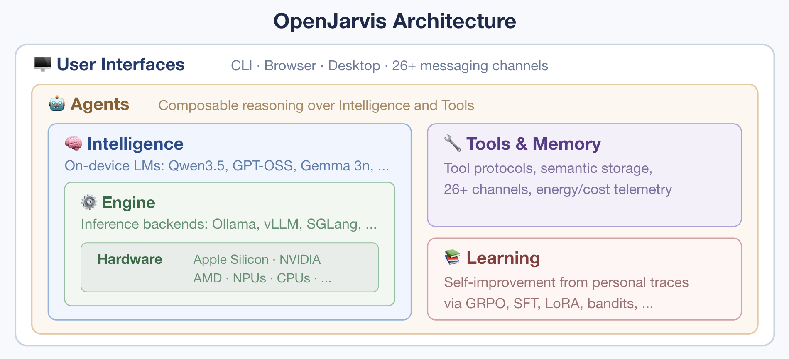

# Architecture Overview

OpenJarvis is a research framework for studying on-device AI systems. Its architecture is organized around **five core abstractions** -- Intelligence, Engine, Agentic Logic, Memory, and Learning -- that work together through trace-driven feedback.



---

## Primitive Descriptions

### Intelligence

The Intelligence primitive handles **model definition and catalog**. It maintains a catalog of known models (`BUILTIN_MODELS`) with metadata such as parameter count, context length, VRAM requirements, and supported engines. The `IntelligenceConfig` captures the full identity of the configured model — its weight path, quantization format, preferred engine, fallback chain, and generation defaults (`temperature`, `max_tokens`, `top_p`, `top_k`, `repetition_penalty`, `stop_sequences`).

Models discovered at runtime from running engines are automatically merged into the `ModelRegistry`, so the system always has an up-to-date view of what is available. Query routing has moved to the Learning primitive — see the [Learning & Traces](learning.md) documentation.

### Engine

The Engine primitive provides the **inference runtime** — the layer that actually runs language models. All backends implement the `InferenceEngine` ABC with a uniform interface: `generate()`, `stream()`, `list_models()`, and `health()`. Supported backends include Ollama, vLLM, SGLang, llama.cpp, and Cloud (OpenAI, Anthropic, Google).

Each engine is configured via its own sub-section in `config.toml` (e.g., `[engine.ollama]`, `[engine.vllm]`, `[engine.llamacpp]`). Engine discovery probes all registered backends for health, returning healthy engines sorted with the user's configured default first. The system automatically falls back to any available engine if the preferred one is unavailable.

### Agentic Logic

The Agentic Logic primitive implements **pluggable agents** that handle queries with varying levels of sophistication. The agent hierarchy is organized around `BaseAgent` (ABC with concrete helpers) and `ToolUsingAgent` (intermediate base for agents that accept tools, with `accepts_tools = True`). Nine agent types are available: `SimpleAgent` (single-turn, no tools), `OrchestratorAgent` (multi-turn tool-calling loop with function_calling and structured modes), `NativeReActAgent` (Thought-Action-Observation loop), `NativeOpenHandsAgent` (CodeAct-style code execution), `RLMAgent` (recursive LM with persistent REPL), `OpenHandsAgent` (wraps real `openhands-sdk`), `ClaudeCodeAgent` (Claude Agent SDK via Node.js subprocess), `OperativeAgent` (persistent scheduled agent with state management), and `MonitorOperativeAgent` (long-horizon agent with configurable strategy axes).

The sandbox module (`openjarvis.sandbox`) adds a `SandboxedAgent` wrapper that runs any `BaseAgent` inside a Docker or Podman container with mount-security enforcement, and a `ContainerRunner` that manages the container lifecycle.

Agent behavior is configured through `[agent]` in `config.toml`, including the default agent, turn limits, tool list, optional system prompt, and the `context_from_memory` flag (previously `context_injection`) that controls automatic memory context injection. Sandbox configuration lives in `[sandbox]`. All agents implement the `BaseAgent` ABC with a `run()` method, and are registered via `@AgentRegistry.register("name")`.

### Memory

The Memory primitive provides **persistent, searchable storage** for documents and knowledge. Five backends are available: SQLite/FTS5 (zero-dependency default), FAISS (dense vector retrieval), ColBERTv2 (late interaction), BM25 (classic term-frequency), and Hybrid (Reciprocal Rank Fusion of sparse + dense). Storage backends are configured under `[tools.storage]` in `config.toml` (the `[memory]` section is still accepted as a backward-compatible alias).

The memory pipeline includes document ingestion, chunking, embedding generation, and context injection. When a user sends a query and `agent.context_from_memory` is enabled, relevant documents are retrieved and prepended to the prompt with source attribution.

### Learning & Traces

The Learning system is the fifth primitive, connecting the other four through **trace-driven feedback**. Every agent interaction can produce a `Trace` capturing the full sequence of steps — routing decisions, memory retrieval, inference calls, tool invocations, and final responses. The `TraceAnalyzer` computes statistics from accumulated traces, and the `TraceDrivenPolicy` uses these statistics to learn which model/agent/tool combinations produce the best outcomes for different query types.

The learning system is configured through nested sub-sections in `config.toml`: `[learning.routing]` controls the router policy (heuristic, learned, sft, grpo), `[learning.intelligence]` controls the model-level learning policy, `[learning.agent]` controls agent advisor and ICL updater policies, and `[learning.metrics]` sets the composite reward function weights.

---

## The Registry Pattern

All extensible components in OpenJarvis use a **decorator-based registry** for runtime discovery. The pattern is implemented in `RegistryBase[T]`, a generic base class that provides isolated storage per typed subclass.

```python
from openjarvis.core.registry import EngineRegistry

@EngineRegistry.register("ollama")
class OllamaEngine(InferenceEngine):
    ...
```

Each registry provides:

| Method | Description |
|--------|-------------|
| `register(key)` | Decorator that registers a class under a key |
| `register_value(key, value)` | Imperative registration |
| `get(key)` | Retrieve by key (raises `KeyError` if missing) |
| `create(key, *args, **kwargs)` | Look up and instantiate |
| `items()` | All `(key, entry)` pairs |
| `keys()` | All registered keys |
| `contains(key)` | Check if key exists |
| `clear()` | Remove all entries (for tests) |

**Typed registries** in the system:

| Registry | Type Parameter | Purpose |
|----------|---------------|---------|
| `ModelRegistry` | `Any` (ModelSpec) | Model metadata |
| `EngineRegistry` | `Type[InferenceEngine]` | Inference backends |
| `MemoryRegistry` | `Type[MemoryBackend]` | Memory backends |
| `AgentRegistry` | `Type[BaseAgent]` | Agent implementations |
| `ToolRegistry` | `Any` (BaseTool classes) | Tool implementations |
| `RouterPolicyRegistry` | `Any` (RouterPolicy classes) | Router policies |
| `BenchmarkRegistry` | `Any` (BaseBenchmark classes) | Benchmark implementations |
| `ChannelRegistry` | `Any` (BaseChannel classes) | Channel implementations |

!!! info "Adding a new component"
    To add a new backend, implement the appropriate ABC and decorate it with
    the corresponding registry decorator. No factory modifications are needed --
    the component becomes automatically discoverable at runtime.

---

## Source Directory Layout

```
src/openjarvis/
    core/               Core infrastructure shared by all primitives
        registry.py         RegistryBase[T] and typed subclass registries
        types.py            Message, ModelSpec, Trace, TelemetryRecord, etc.
        config.py           JarvisConfig, hardware detection, TOML loading
        events.py           EventBus pub/sub system (EventType, Event)

    intelligence/       Intelligence primitive -- model definition & catalog
        model_catalog.py    BUILTIN_MODELS list, merge_discovered_models()
        _stubs.py           (backward-compat shim -- re-exports from learning._stubs)
        router.py           (backward-compat shim -- re-exports from learning.router)

    engine/             Engine primitive -- inference runtime backends
        _stubs.py           InferenceEngine ABC
        _base.py            EngineConnectionError, messages_to_dicts()
        _openai_compat.py   Shared base for OpenAI-compatible engines
        _discovery.py       discover_engines(), discover_models(), get_engine()
        ollama.py           Ollama backend (native HTTP API)
        openai_compat_engines.py  Data-driven registration (vLLM, SGLang, llama.cpp, MLX, LM Studio)
        cloud.py            Cloud backend (OpenAI, Anthropic, Google SDKs)

    agents/             Agentic Logic primitive -- pluggable agents
        _stubs.py           BaseAgent ABC, ToolUsingAgent, AgentContext, AgentResult
        simple.py           SimpleAgent (single-turn, no tools)
        orchestrator.py     OrchestratorAgent (multi-turn tool loop, function_calling + structured)
        native_react.py     NativeReActAgent (Thought-Action-Observation loop)
        native_openhands.py NativeOpenHandsAgent (CodeAct-style code execution)
        rlm.py              RLMAgent (recursive LM with persistent REPL)
        openhands.py        OpenHandsAgent (wraps real openhands-sdk)
        react.py            Backward-compat shim (re-exports NativeReActAgent as ReActAgent)
        claude_code.py      ClaudeCodeAgent (Claude Agent SDK via Node.js subprocess)
        claude_code_runner/ Bundled Node.js runner for the Claude Agent SDK

    sandbox/            Container sandbox for isolated agent execution
        runner.py           ContainerRunner (Docker/Podman lifecycle), SandboxedAgent wrapper
        mount_security.py   MountAllowlist, validate_mounts() (path security)

    memory/             Memory primitive -- persistent searchable storage
        _stubs.py           MemoryBackend ABC, RetrievalResult
        sqlite.py           SQLite/FTS5 backend (zero-dependency default)
        faiss_backend.py    FAISS dense retrieval backend
        colbert_backend.py  ColBERTv2 late interaction backend
        bm25.py             BM25 (Okapi) term-frequency backend
        hybrid.py           Hybrid RRF fusion backend
        chunking.py         ChunkConfig, Chunk, chunk_text()
        ingest.py           Document ingestion (file reading, directory walking)
        context.py          Context injection (inject_context, source attribution)
        embeddings.py       Embedder ABC, SentenceTransformerEmbedder

    learning/           Learning system -- router policies & rewards
        _stubs.py           RouterPolicy ABC, QueryAnalyzer ABC, RewardFunction ABC, RoutingContext
        router.py           HeuristicRouter, DefaultQueryAnalyzer, build_routing_context()
        heuristic_policy.py Wires HeuristicRouter into RouterPolicyRegistry
        trace_policy.py     TraceDrivenPolicy (learns from trace outcomes)
        grpo_policy.py      GRPORouterPolicy (stub for future RL)
        heuristic_reward.py HeuristicRewardFunction (latency/cost/efficiency)

    traces/             Trace system -- interaction recording
        store.py            TraceStore (SQLite persistence)
        collector.py        TraceCollector (wraps agents, records traces)
        analyzer.py         TraceAnalyzer (aggregated statistics)

    tools/              Tool system -- pluggable tool implementations
        _stubs.py           BaseTool ABC, ToolSpec, ToolExecutor
        calculator.py       CalculatorTool (ast-based safe eval)
        think.py            ThinkTool (reasoning scratchpad)
        retrieval.py        RetrievalTool (memory search)
        llm.py              LLMTool (sub-model calls)
        file_read.py        FileReadTool (safe file reading)

    telemetry/          Telemetry -- inference metrics recording
        store.py            TelemetryStore (SQLite, EventBus subscription)
        aggregator.py       TelemetryAggregator (per-model/engine stats)
        wrapper.py          instrumented_generate() wrapper

    server/             API server -- OpenAI-compatible HTTP API
        app.py              FastAPI application factory
        routes.py           /v1/chat/completions, /v1/models, /health

    bench/              Benchmarking framework
        _stubs.py           BaseBenchmark ABC, BenchmarkSuite
        latency.py          LatencyBenchmark (per-call latency)
        throughput.py       ThroughputBenchmark (tokens/second)

    security/           Security guardrails
        _stubs.py           BaseScanner ABC
        types.py            ThreatLevel, RedactionMode, ScanFinding, ScanResult
        scanner.py          SecretScanner, PIIScanner
        guardrails.py       GuardrailsEngine (wraps InferenceEngine)
        file_policy.py      is_sensitive_file(), DEFAULT_SENSITIVE_PATTERNS
        audit.py            AuditLogger (SQLite security events)

    channels/           Channel messaging
        _stubs.py           BaseChannel ABC, ChannelMessage, ChannelStatus
        whatsapp_baileys.py WhatsAppBaileysChannel (Baileys protocol via Node.js bridge)
        whatsapp_baileys_bridge/ Bundled Node.js Baileys bridge

    scheduler/          Task scheduling system
        scheduler.py        TaskScheduler (cron/interval/once, background polling)
        store.py            SchedulerStore (SQLite persistence + run logs)
        tools.py            MCP scheduler tools (schedule_task, list, pause, resume, cancel)

    cli/                CLI commands (Click-based)
        ask.py              jarvis ask -- query the assistant
        serve.py            jarvis serve -- start API server

    sdk.py              Jarvis class -- high-level Python SDK
    mcp/                MCP (Model Context Protocol) layer
```

---

## How the Primitives Interact

### EventBus: The Connective Tissue

All primitives communicate through a **thread-safe pub/sub EventBus** defined in `core/events.py`. The bus uses synchronous dispatch -- subscribers are called in registration order within the publishing thread.

**Event types** in the system:

| Event | Publisher | Purpose |
|-------|----------|---------|
| `INFERENCE_START` / `INFERENCE_END` | Engine / Agent | Track inference calls |
| `TOOL_CALL_START` / `TOOL_CALL_END` | ToolExecutor | Track tool usage |
| `MEMORY_STORE` / `MEMORY_RETRIEVE` | Memory backends | Track memory operations |
| `AGENT_TURN_START` / `AGENT_TURN_END` | Agents | Track agent lifecycle |
| `TELEMETRY_RECORD` | TelemetryStore | Publish telemetry records |
| `TRACE_STEP` / `TRACE_COMPLETE` | TraceCollector | Trace lifecycle events |
| `CHANNEL_MESSAGE_RECEIVED` / `CHANNEL_MESSAGE_SENT` | WhatsAppBaileysChannel | Track channel messaging |
| `SECURITY_SCAN` / `SECURITY_ALERT` / `SECURITY_BLOCK` | GuardrailsEngine | Track security scanning |
| `scheduler_task_start` / `scheduler_task_end` | TaskScheduler | Track scheduled task execution |

### Dependency Flow

The primitives form a directed dependency graph:

1. **Agentic Logic** depends on Engine (for inference) and Memory (for context)
2. **Intelligence** provides model selection to agents via Learning policies
3. **Learning** reads from Traces, which are produced by Agentic Logic
4. **Memory** is independent but consumed by agents and tools
5. **Engine** is independent but consumed by agents and the SDK

This creates a feedback loop: agents produce traces, traces inform learning, learning improves routing, and better routing improves agent performance.
