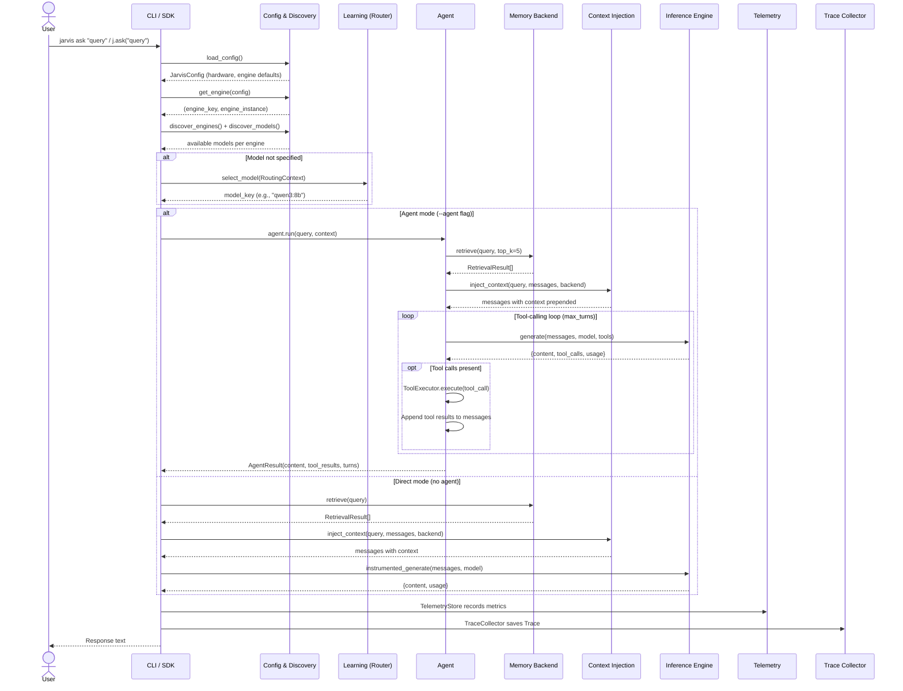

# Query Flow

This page traces the end-to-end journey of a user query through the OpenJarvis system, from the moment it enters the CLI or SDK to the final response and telemetry recording.

---

## Sequence Diagram



---

## Direct Mode vs Agent Mode

OpenJarvis supports two query processing paths, selected by the `--agent` CLI flag or the `agent` parameter in the SDK.

### Direct Mode (Default)

In direct mode, the query goes straight to the inference engine with optional memory context. This is the simplest path -- one inference call, no tool loop.

```bash
# CLI
jarvis ask "What is the capital of France?"

# SDK
j = Jarvis()
response = j.ask("What is the capital of France?")
```

### Agent Mode

In agent mode, the query is handled by a named agent that can perform multiple inference rounds and invoke tools. The `OrchestratorAgent` is the most common choice, enabling a multi-turn tool-calling loop.

```bash
# CLI
jarvis ask --agent orchestrator --tools calculator,think "What is 2^10 + 3^5?"

# SDK
response = j.ask("What is 2^10 + 3^5?", agent="orchestrator", tools=["calculator"])
```

---

## Step-by-Step Walkthrough

### Step 1: Configuration Loading

The journey begins with loading the system configuration:

```python
config = load_config()  # Reads ~/.openjarvis/config.toml
```

This step:

- Detects system hardware (GPU vendor/model, CPU, RAM)
- Recommends the best inference engine for the detected hardware
- Overlays any user overrides from the TOML file
- Returns a `JarvisConfig` dataclass with all settings

### Step 2: Engine Discovery

Next, the system finds a running inference engine:

```python
resolved = get_engine(config, engine_key)
# Returns (engine_key, engine_instance) or None
```

The discovery process:

1. If a specific engine was requested (`--engine` flag), try that engine
2. Otherwise, try the default engine from config (e.g., `"ollama"`)
3. If the default is unhealthy, probe all registered engines and use the first healthy one
4. If no engine is available, exit with an error message

### Step 3: Model Discovery and Registration

Once an engine is found, the system discovers available models:

```python
register_builtin_models()          # Register known models (catalog)
all_engines = discover_engines(config)
all_models = discover_models(all_engines)
for ek, model_ids in all_models.items():
    merge_discovered_models(ek, model_ids)  # Register runtime-discovered models
```

### Step 4: Model Routing

If no model was explicitly specified, the router policy selects one:

```python
from openjarvis.learning import ensure_registered
from openjarvis.learning.router import build_routing_context
ensure_registered()  # Ensure learning policies are registered

policy_key = router_policy or config.learning.routing.policy
router_cls = RouterPolicyRegistry.get(policy_key)
router = router_cls(
    available_models=all_models.get(engine_name, []),
    default_model=config.intelligence.default_model,
    fallback_model=config.intelligence.fallback_model,
)

ctx = build_routing_context(query_text)
model_name = router.select_model(ctx)
```

The `build_routing_context()` function (in `learning/router.py`) analyzes the query for code patterns, math keywords, length, and urgency. The router then applies its rules (heuristic or learned) to select the optimal model.

### Step 5: Memory Context Injection

If memory context injection is enabled (default: `true`) and the memory backend has indexed documents:

```python
backend = _get_memory_backend(config)
if backend is not None:
    ctx_cfg = ContextConfig(
        top_k=config.memory.context_top_k,        # Default: 5
        min_score=config.memory.context_min_score,  # Default: 0.1
        max_context_tokens=config.memory.context_max_tokens,  # Default: 2048
    )
    messages = inject_context(query_text, messages, backend, config=ctx_cfg)
```

This retrieves relevant chunks from the memory backend and prepends a system message with the retrieved context and source attribution.

!!! tip "Disabling context injection"
    Use `--no-context` on the CLI or `context=False` in the SDK to skip memory context injection.

### Step 6: Inference Generation

**In direct mode**, the query is sent to the engine via the instrumented wrapper:

```python
result = instrumented_generate(
    engine, messages,
    model=model_name,
    bus=bus,
    temperature=temperature,
    max_tokens=max_tokens,
)
```

The `instrumented_generate()` wrapper:

1. Publishes `INFERENCE_START` on the event bus
2. Records the start time
3. Calls `engine.generate()`
4. Records end time, calculates latency
5. Publishes `INFERENCE_END` with timing and token counts
6. Publishes `TELEMETRY_RECORD` with the full `TelemetryRecord`

**In agent mode**, the agent manages inference calls internally, potentially making multiple rounds with tool calls in between.

### Step 7: Tool Execution (Agent Mode Only)

When the `OrchestratorAgent` receives tool calls in the model's response:

1. Each tool call is dispatched to the `ToolExecutor`
2. The executor publishes `TOOL_CALL_START`, executes the tool, publishes `TOOL_CALL_END`
3. Tool results are appended to the message history as `TOOL` messages
4. The updated messages are sent back to the engine for the next round
5. This loop continues until the model responds without tool calls or `max_turns` is reached

### Step 8: Telemetry Recording

After every inference call, a `TelemetryRecord` is created and persisted:

```python
@dataclass(slots=True)
class TelemetryRecord:
    timestamp: float
    model_id: str
    prompt_tokens: int
    completion_tokens: int
    total_tokens: int
    latency_seconds: float
    ttft: float              # Time to first token
    cost_usd: float
    energy_joules: float
    power_watts: float
    engine: str
    agent: str
    metadata: Dict[str, Any]
```

The `TelemetryStore` subscribes to `TELEMETRY_RECORD` events on the EventBus and writes records to `~/.openjarvis/telemetry.db`.

### Step 9: Trace Recording

When a `TraceCollector` is wrapping the agent, a complete `Trace` is built from the events captured during execution:

1. All `INFERENCE_START`/`END` events become `GENERATE` steps
2. All `TOOL_CALL_START`/`END` events become `TOOL_CALL` steps
3. All `MEMORY_RETRIEVE` events become `RETRIEVE` steps
4. A final `RESPOND` step captures the output
5. The trace is saved to the `TraceStore` and `TRACE_COMPLETE` is published

### Step 10: Response Delivery

The final response is delivered to the user:

- **CLI:** Printed to stdout (or as JSON with `--json`)
- **SDK:** Returned as a string from `ask()` or as a dict from `ask_full()`

---

## EventBus Activity During a Query

The following events are published during a typical query in agent mode:

```
AGENT_TURN_START    {agent: "orchestrator", input: "What is 2+2?"}
INFERENCE_START     {model: "qwen3:8b", engine: "ollama", turn: 1}
INFERENCE_END       {model: "qwen3:8b", engine: "ollama", turn: 1}
TELEMETRY_RECORD    {model_id: "qwen3:8b", latency: 0.8, tokens: 150}
TOOL_CALL_START     {tool: "calculator", arguments: {expression: "2+2"}}
TOOL_CALL_END       {tool: "calculator", success: true, latency: 0.01}
INFERENCE_START     {model: "qwen3:8b", engine: "ollama", turn: 2}
INFERENCE_END       {model: "qwen3:8b", engine: "ollama", turn: 2}
TELEMETRY_RECORD    {model_id: "qwen3:8b", latency: 0.5, tokens: 80}
AGENT_TURN_END      {agent: "orchestrator", turns: 2, content_length: 12}
TRACE_COMPLETE      {trace: Trace(...)}
```

---

## SDK Query Flow

The `Jarvis` class in `sdk.py` provides the same query flow through a Python API:

```python
from openjarvis import Jarvis

j = Jarvis(model="qwen3:8b", engine_key="ollama")

# Direct mode
response = j.ask("Hello")

# Agent mode with tools
response = j.ask(
    "What is 2^10?",
    agent="orchestrator",
    tools=["calculator"],
)

# Full result with metadata
result = j.ask_full("Hello")
# {
#     "content": "Hello! How can I help you?",
#     "usage": {"prompt_tokens": 10, "completion_tokens": 15, "total_tokens": 25},
#     "model": "qwen3:8b",
#     "engine": "ollama",
# }

j.close()
```

The SDK handles lazy engine initialization, telemetry setup, memory context injection, and resource cleanup internally. The `ask()` method delegates to `ask_full()` and extracts just the content string.
