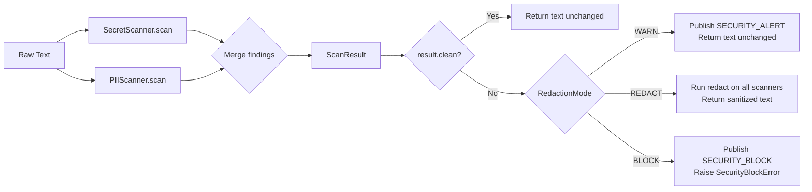
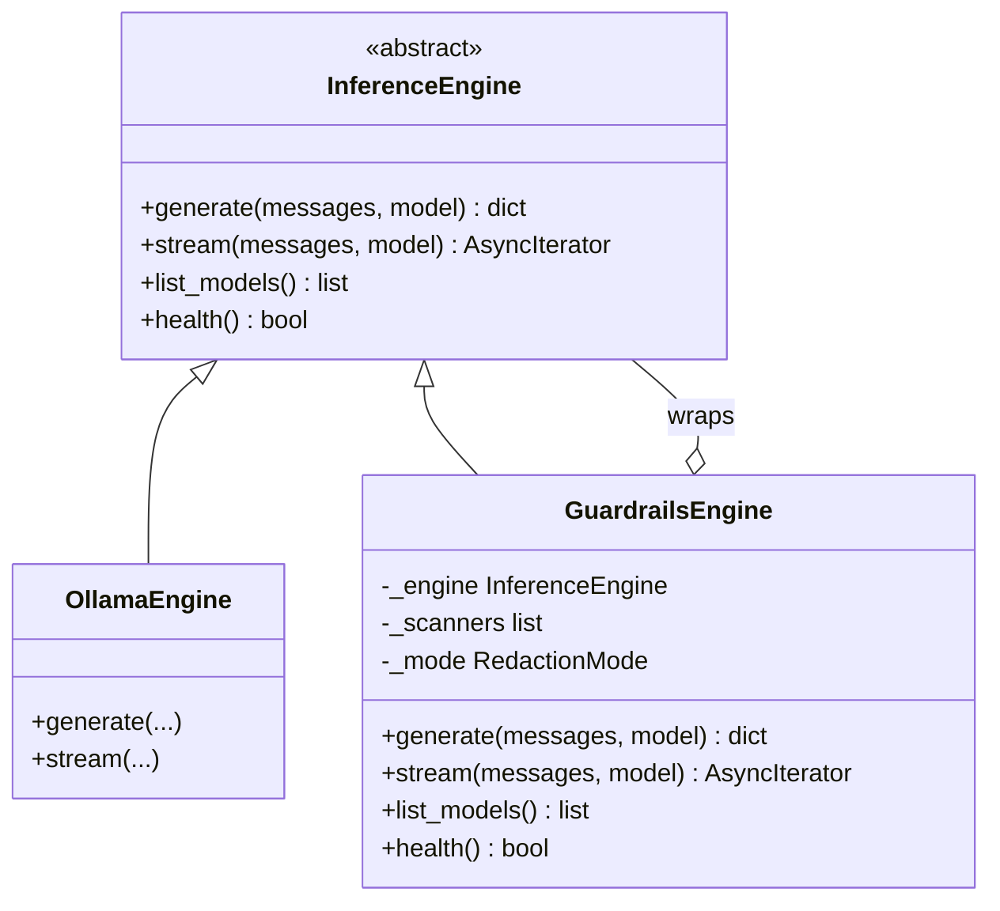
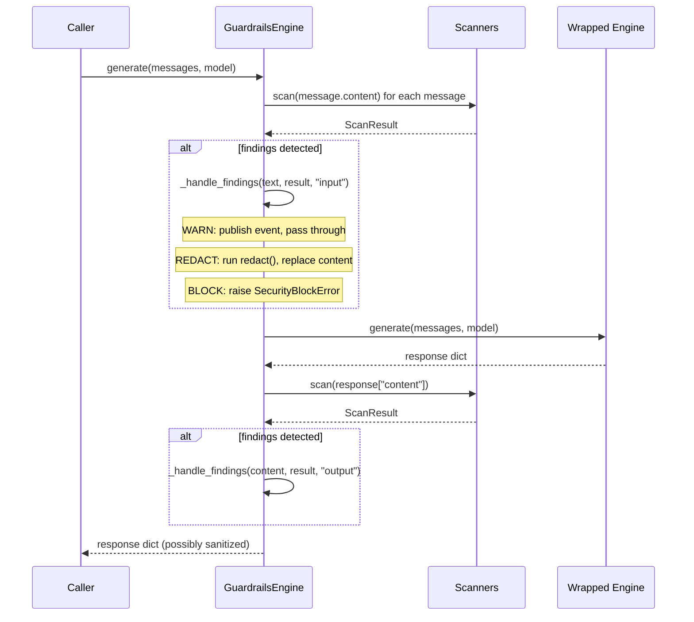
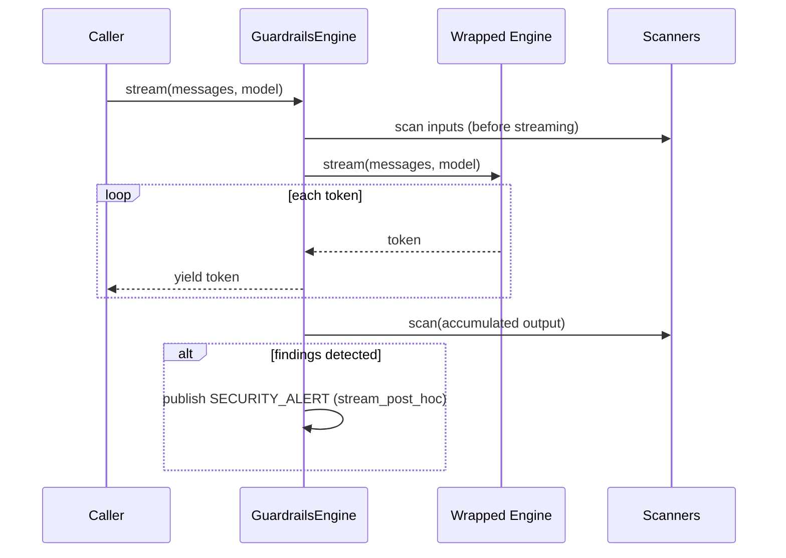
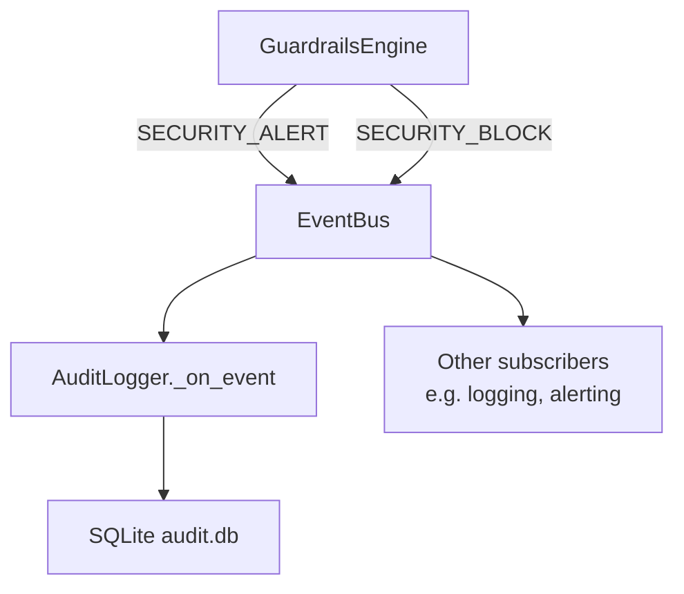
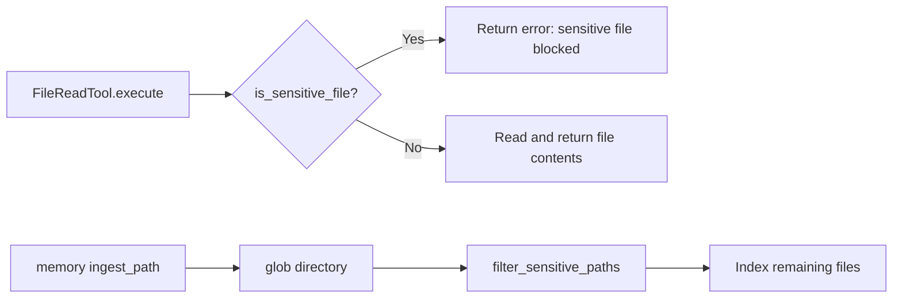

# Security Architecture

The security module is a cross-cutting concern that wraps the inference pipeline rather than replacing it. Scanners run on raw text strings independently of any model or agent, and the `GuardrailsEngine` decorator composes them around any `InferenceEngine` backend without changing the engine's public interface.

---

## Design Principles

- **Composable, not mandatory.** Security scanning is opt-in and composable. You wrap an engine with `GuardrailsEngine`; you do not configure a global interceptor.
- **Scanner-agnostic.** The `BaseScanner` ABC defines a two-method interface (`scan`, `redact`). Any scanner can be plugged in, including user-defined ones.
- **Fail-safe modes.** The three redaction modes (WARN, REDACT, BLOCK) cover a spectrum from visibility to enforcement, allowing gradual tightening without code changes.
- **Audit by default.** The `AuditLogger` records security events to SQLite so that findings are traceable after the fact.

---

## Scanner Pipeline

Each scan pass runs all registered scanners sequentially and merges their findings into a single `ScanResult`. The order of scanner execution does not affect correctness, only which patterns are reported first.

The redaction step in REDACT mode applies each scanner's `redact()` method in sequence. Later scanners see the already-redacted output of earlier ones, so patterns do not interfere.

---

## GuardrailsEngine Wrapper Pattern

`GuardrailsEngine` implements the full `InferenceEngine` ABC and delegates every call to a wrapped engine instance. This means any engine — `OllamaEngine`, `VLLMEngine`, `LlamaCppEngine` — can be made security-aware without modifying the engine itself.

Because `GuardrailsEngine` is itself an `InferenceEngine`, it can be nested arbitrarily (for example, wrapped again in an instrumented engine) or passed to any code that accepts an engine.

### generate() Call Sequence

### stream() Behavior

For streaming, the engine yields tokens to the caller in real time. The security layer accumulates the full output and scans it after the stream ends. Because the scan is post-hoc, BLOCK mode cannot prevent delivery of streamed tokens — it only applies to the input side.

---

## Event Flow

Security events flow through the `EventBus` using three event types:

| Event | When Published | Payload Keys |
|-------|----------------|--------------|
| `SECURITY_SCAN` | (Reserved for future use) | — |
| `SECURITY_ALERT` | Findings detected in WARN or REDACT mode | `direction`, `findings`, `mode` |
| `SECURITY_BLOCK` | Findings detected in BLOCK mode | `direction`, `findings`, `mode` |

The `direction` field is either `"input"` or `"output"`. The `findings` value is a list of dicts with keys `pattern`, `threat`, and `description`.

The `AuditLogger` subscribes to all three event types and writes them to SQLite. This subscription is established at construction time:

---

## File Policy Integration

The file policy (`file_policy.py`) operates independently of the scanner pipeline. It answers a single yes/no question: is this file path considered sensitive?

### Integration Points

**FileReadTool** calls `is_sensitive_file()` before reading any path. If the path matches a sensitive pattern, the tool returns an error rather than the file contents. This cannot be bypassed at the tool level.

**Memory ingest path** (`memory/ingest.py`) uses `filter_sensitive_paths()` to remove sensitive files from a directory listing before indexing. Files matching sensitive patterns are silently skipped.

The file policy does not publish events or use the event bus. It is a pure function — deterministic, stateless, and side-effect-free.

---

## Audit Logging Architecture

`AuditLogger` maintains a single SQLite table (`security_events`) with the following schema:

| Column | Type | Description |
|--------|------|-------------|
| `id` | `INTEGER PRIMARY KEY` | Auto-increment row ID |
| `timestamp` | `REAL` | Unix timestamp of the event |
| `event_type` | `TEXT` | `SecurityEventType` value string |
| `findings_json` | `TEXT` | JSON-encoded list of `ScanFinding` dicts |
| `content_preview` | `TEXT` | Short preview of the scanned content |
| `action_taken` | `TEXT` | Mode string (`warn`, `redact`, `block`) |

The database is written in append-only mode. There is no built-in rotation or truncation — manage retention externally by deleting old entries with SQLite tooling or by using a path-per-session audit log.

The default path is `~/.openjarvis/audit.db`, configurable via `security.audit_log_path` in `config.toml`.

---

## Relationship to Other Modules

| Module | How Security Integrates |
|--------|------------------------|
| Engine | `GuardrailsEngine` wraps any `InferenceEngine` |
| Tools | `FileReadTool` calls `is_sensitive_file()` |
| Memory | Ingest path calls `filter_sensitive_paths()` |
| EventBus | Security events published to `SECURITY_ALERT`, `SECURITY_BLOCK` |
| Config | `SecurityConfig` dataclass loaded from `[security]` in `config.toml` |

---

## See Also

- [User Guide: Security](../user-guide/security.md) — how to configure and use the security system
- [API Reference: Security](../api-reference/openjarvis/security/index.md) — complete class and function signatures
- [Architecture: Query Flow](query-flow.md) — where security sits in the overall request lifecycle
