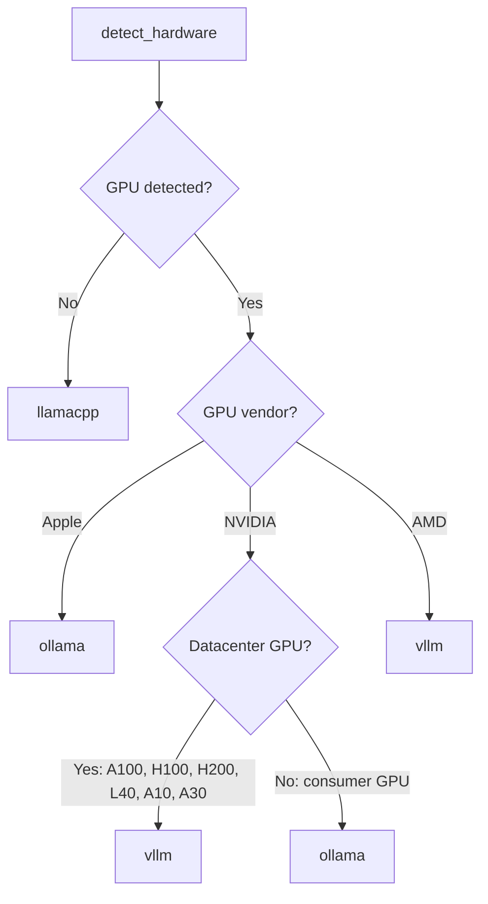

# Configuration

OpenJarvis uses a TOML configuration file to control engine selection, model identity, memory backends, agent behavior, and more. This page is the complete reference for every configuration option, organized by primitive.

## Config File Location

The configuration file lives at:

```
~/.openjarvis/config.toml
```

OpenJarvis creates the `~/.openjarvis/` directory and populates it with a default config when you run `jarvis init`.

## Generating Configuration

### First-Time Setup

```bash
jarvis init
```

This command:

1. Runs hardware auto-detection (GPU vendor/model/VRAM, CPU brand/cores, RAM)
2. Selects the recommended engine based on your hardware
3. Writes `~/.openjarvis/config.toml` with sensible defaults

### Regenerating Configuration

To overwrite an existing config:

```bash
jarvis init --force
```

!!! warning
    `--force` overwrites your existing config file. Back up your config first if you have custom settings.

## Configuration Sections

The config file is organized into TOML sections corresponding to the five primitives. Every field has a default value, so you only need to specify values you want to change.

---

### `[engine]` — Inference Engine

Controls which inference engine is used and how each engine is reached. Engine settings are now **nested** under per-engine sub-sections instead of flat fields.

```toml
[engine]
default = "ollama"

[engine.ollama]
host = "http://localhost:11434"

[engine.vllm]
host = "http://localhost:8000"

[engine.sglang]
host = "http://localhost:30000"

# [engine.llamacpp]
# host = "http://localhost:8080"
# binary_path = ""
```

**`[engine]` top-level:**

| Field | Type | Default | Description |
|-------|------|---------|-------------|
| `default` | string | Auto-detected | Default engine backend. One of: `ollama`, `vllm`, `llamacpp`, `sglang`, `cloud`. Set automatically by `jarvis init` based on hardware detection. |

**`[engine.ollama]`:**

| Field | Type | Default | Description |
|-------|------|---------|-------------|
| `host` | string | `http://localhost:11434` | Base URL for the Ollama API server. |

**`[engine.vllm]`:**

| Field | Type | Default | Description |
|-------|------|---------|-------------|
| `host` | string | `http://localhost:8000` | Base URL for the vLLM OpenAI-compatible server. |

**`[engine.sglang]`:**

| Field | Type | Default | Description |
|-------|------|---------|-------------|
| `host` | string | `http://localhost:30000` | Base URL for the SGLang server. |

**`[engine.llamacpp]`:**

| Field | Type | Default | Description |
|-------|------|---------|-------------|
| `host` | string | `http://localhost:8080` | Base URL for the llama.cpp HTTP server (`llama-server`). |
| `binary_path` | string | `""` | Path to the llama.cpp binary, if not on `$PATH`. |

!!! tip "Engine fallback"
    If the configured default engine is unreachable, OpenJarvis automatically probes all registered engines and falls back to any healthy one.

!!! note "Backward compatibility"
    The old flat field names (`ollama_host`, `vllm_host`, `llamacpp_host`, `llamacpp_path`, `sglang_host`) are still accepted as backward-compatible properties. New configurations should use the nested sub-section format.

---

### `[intelligence]` — Model Identity and Generation Defaults

Controls which model is used, its weight paths, quantization, and the default sampling parameters for generation. Generation parameters such as `temperature` and `max_tokens` now live here rather than under `[agent]`.

```toml
[intelligence]
default_model = ""
fallback_model = ""
# model_path = ""
# checkpoint_path = ""
# quantization = "none"
# preferred_engine = ""
# provider = ""
temperature = 0.7
max_tokens = 1024
# top_p = 0.9
# top_k = 40
# repetition_penalty = 1.0
# stop_sequences = ""
```

**Model identity fields:**

| Field | Type | Default | Description |
|-------|------|---------|-------------|
| `default_model` | string | `""` | Preferred model identifier (e.g., `qwen3:8b`). When empty, the router policy selects the model dynamically. |
| `fallback_model` | string | `""` | Model to use if the default is unavailable. |
| `model_path` | string | `""` | Path or HuggingFace repo ID for local weights (e.g., `"./models/qwen3-8b.gguf"` or `"Qwen/Qwen3-8B"`). |
| `checkpoint_path` | string | `""` | Path to a fine-tuned checkpoint or LoRA adapter directory. |
| `quantization` | string | `"none"` | Quantization format. Accepted values: `none`, `fp8`, `int8`, `int4`, `gguf_q4`, `gguf_q8`. |
| `preferred_engine` | string | `""` | Override engine for this model (e.g., `"vllm"`). Takes priority over `engine.default`. |
| `provider` | string | `""` | Model provider hint: `local`, `openai`, `anthropic`, `google`. Used by the Cloud engine to route API calls. |

**Generation default fields** (overridable per-call):

| Field | Type | Default | Description |
|-------|------|---------|-------------|
| `temperature` | float | `0.7` | Sampling temperature. Lower values produce more deterministic output. |
| `max_tokens` | int | `1024` | Maximum number of tokens to generate per call. |
| `top_p` | float | `0.9` | Nucleus sampling probability mass. |
| `top_k` | int | `40` | Top-k sampling: only consider the top-k tokens at each step. |
| `repetition_penalty` | float | `1.0` | Penalize repeated tokens. Values > 1 reduce repetition. |
| `stop_sequences` | string | `""` | Comma-separated stop strings. Generation halts when any stop string is produced. |

When both `default_model` and `fallback_model` are empty, OpenJarvis uses the configured router policy (see `[learning]`) to select a model from those available on the active engine.

### Engine Selection Priority

When resolving which engine to use for a model, `SystemBuilder`, `sdk.py`, and `cli/ask.py` check fields in this order:

```
1. Explicit --engine CLI flag or engine_key= SDK parameter
2. config.intelligence.preferred_engine
3. config.engine.default
4. First healthy engine discovered at runtime
```

This lets you pin a specific model to a specific engine without changing the global engine default:

```toml
[engine]
default = "ollama"

[intelligence]
default_model = "llama3.2:3b"
model_path = "./models/llama-3.2-3b.Q4_K_M.gguf"
quantization = "gguf_q4"
preferred_engine = "llamacpp"
```

---

### `[agent]` — Agent Behavior

Controls the default agent, turn limits, tool selection, system prompt, and memory context injection.

```toml
[agent]
default_agent = "simple"
max_turns = 10
# tools = ""
# objective = ""
# system_prompt = ""
# system_prompt_path = ""
context_from_memory = true
```

| Field | Type | Default | Description |
|-------|------|---------|-------------|
| `default_agent` | string | `"simple"` | Default agent to use. Available: `simple`, `orchestrator`, `react`, `operative`, `monitor_operative`. |
| `max_turns` | int | `10` | Maximum number of tool-calling turns for the orchestrator agent before it must produce a final answer. |
| `tools` | string | `""` | Comma-separated list of tools to enable by default (e.g., `"calculator,think"`). |
| `objective` | string | `""` | Concise purpose string for routing, learning, and documentation. |
| `system_prompt` | string | `""` | Inline system prompt. Takes precedence over `system_prompt_path` when set. |
| `system_prompt_path` | string | `""` | Path to a system prompt file (`.txt` or `.md`). |
| `context_from_memory` | bool | `true` | Whether to automatically inject relevant memory context into queries. |

!!! note "Generation parameters moved"
    `temperature` and `max_tokens` have moved from `[agent]` to `[intelligence]`. Old configs with these fields under `[agent]` are automatically migrated to `[intelligence]` at load time.

!!! note "Backward compatibility"
    The old field name `default_tools` is still accepted as a backward-compatible property for `tools`. New configurations should use `tools`.

!!! info "Context injection"
    When `context_from_memory = true` and documents have been indexed, every query automatically searches memory for relevant chunks and prepends them as system context. This gives the model access to your indexed knowledge base without any extra steps. Disable with `--no-context` on the CLI or `context=False` in the SDK.

---

### `[learning]` — Learning Policies

Controls whether the learning system is enabled and configures per-primitive policies through nested sub-sections.

```toml
[learning]
enabled = false
update_interval = 100
# auto_update = false

[learning.routing]
policy = "heuristic"
# min_samples = 5

# [learning.intelligence]
# policy = "none"

# [learning.agent]
# policy = "none"

# [learning.metrics]
# accuracy_weight = 0.6
# latency_weight = 0.2
# cost_weight = 0.1
# efficiency_weight = 0.1
```

**`[learning]` top-level:**

| Field | Type | Default | Description |
|-------|------|---------|-------------|
| `enabled` | bool | `false` | Whether the learning system is active. |
| `update_interval` | int | `100` | Number of traces between automatic policy updates. |
| `auto_update` | bool | `false` | Whether to trigger policy updates automatically when the interval is reached. |

**`[learning.routing]` — Router policy:**

| Field | Type | Default | Description |
|-------|------|---------|-------------|
| `policy` | string | `"heuristic"` | Router policy for model selection. Available: `heuristic`, `learned` (trace-driven), `sft` (supervised fine-tuning), `grpo` (RL stub). |
| `min_samples` | int | `5` | Minimum number of traces required before trusting a learned routing decision. |

**`[learning.intelligence]` — Intelligence learning policy:**

| Field | Type | Default | Description |
|-------|------|---------|-------------|
| `policy` | string | `"none"` | Intelligence learning policy. Available: `none`, `sft`. Use `sft` to learn model routing from accumulated traces. |

**`[learning.agent]` — Agent learning policy:**

| Field | Type | Default | Description |
|-------|------|---------|-------------|
| `policy` | string | `"none"` | Agent learning policy. Available: `none`, `agent_advisor`, `icl_updater`. |
| `max_icl_examples` | int | `20` | Maximum number of in-context examples to maintain in the ICL example library. |
| `advisor_confidence_threshold` | float | `0.7` | Minimum confidence score for the advisor to recommend a strategy change. |

**`[learning.metrics]` — Reward / optimization metric weights:**

| Field | Type | Default | Description |
|-------|------|---------|-------------|
| `accuracy_weight` | float | `0.6` | Weight for outcome accuracy in the composite reward score. |
| `latency_weight` | float | `0.2` | Weight for inference latency in the composite reward score. |
| `cost_weight` | float | `0.1` | Weight for per-call cost in the composite reward score. |
| `efficiency_weight` | float | `0.1` | Weight for token efficiency in the composite reward score. |

**Router policies:**

| Policy | Description |
|--------|-------------|
| `heuristic` | Rule-based selection using 6 priority rules. Considers model availability, parameter count, context length, and query characteristics. Default. |
| `learned` | Trace-driven policy that learns from past interaction outcomes stored in the trace system. |
| `sft` | Supervised fine-tuning policy that learns routing from labeled trace data. |
| `grpo` | Group Relative Policy Optimization stub for future RL-based routing. |

**Agent policies:**

| Policy | Description |
|--------|-------------|
| `agent_advisor` | Advises on agent strategy (tool sets, turn limits) based on trace patterns. |
| `icl_updater` | In-context learning updater — discovers reusable ICL examples and multi-tool skill sequences from traces. |

You can also override the router policy per-query via the CLI:

```bash
jarvis ask --router heuristic "Hello"
```

!!! note "Backward compatibility"
    The old flat field names `default_policy`, `intelligence_policy`, `agent_policy`, and the comma-separated `reward_weights` string are still accepted as backward-compatible properties. New configurations should use the nested sub-section format. The `tools_policy` field has been removed; use `learning.agent.policy = "icl_updater"` instead.

---

### `[tools.storage]` — Storage Backend

Controls the storage backend used for document memory and context injection. The `context_injection` field has moved to `agent.context_from_memory`.

```toml
[tools.storage]
default_backend = "sqlite"
db_path = "~/.openjarvis/memory.db"
context_top_k = 5
context_min_score = 0.1
context_max_tokens = 2048
chunk_size = 512
chunk_overlap = 64
```

| Field | Type | Default | Description |
|-------|------|---------|-------------|
| `default_backend` | string | `"sqlite"` | Storage backend. Available: `sqlite` (FTS5), `faiss`, `colbert`, `bm25`, `hybrid`. |
| `db_path` | string | `~/.openjarvis/memory.db` | Path to the SQLite memory database. Used by the `sqlite` backend. |
| `context_top_k` | int | `5` | Number of top memory results to inject as context. |
| `context_min_score` | float | `0.1` | Minimum relevance score for a memory result to be included in context. |
| `context_max_tokens` | int | `2048` | Maximum number of tokens to use for injected context. |
| `chunk_size` | int | `512` | Size of document chunks (in tokens) when indexing documents. |
| `chunk_overlap` | int | `64` | Overlap between adjacent chunks (in tokens) when indexing. |

**Memory backends:**

| Backend | Extra Required | Description |
|---------|---------------|-------------|
| `sqlite` | None | SQLite with FTS5 full-text search. Zero dependencies. Default. |
| `faiss` | `memory-faiss` | Facebook AI Similarity Search with sentence-transformer embeddings. |
| `colbert` | `memory-colbert` | ColBERTv2 late-interaction retrieval. Requires PyTorch. |
| `bm25` | `memory-bm25` | BM25 sparse retrieval via `rank-bm25`. |
| `hybrid` | Depends on sub-backends | Reciprocal Rank Fusion combining multiple backends. |

!!! note "Backward compatibility"
    The `[memory]` TOML section is still supported and maps to `[tools.storage]`. New configurations should use `[tools.storage]`. The `context_injection` field under `[memory]` or `[tools.storage]` is automatically migrated to `agent.context_from_memory` at load time.

---

### `[tools.mcp]` — MCP (Model Context Protocol)

Controls the MCP server and external MCP tool provider integration. The MCP adapter supports protocol version 2025-11-25.

```toml
[tools.mcp]
enabled = true
# servers = ""  # JSON list of external MCP server configs
```

| Field | Type | Default | Description |
|-------|------|---------|-------------|
| `enabled` | bool | `true` | Whether to enable the MCP adapter for exposing and consuming tools via MCP. |
| `servers` | string | `""` | JSON-encoded list of external MCP server configuration objects. |

---

### `[server]` — API Server

Controls the OpenAI-compatible API server started by `jarvis serve`.

```toml
[server]
host = "0.0.0.0"
port = 8000
agent = "orchestrator"
model = ""
workers = 1
```

| Field | Type | Default | Description |
|-------|------|---------|-------------|
| `host` | string | `"0.0.0.0"` | Bind address for the server. Use `"127.0.0.1"` to restrict to localhost. |
| `port` | int | `8000` | Port number for the server. |
| `agent` | string | `"orchestrator"` | Agent to use for chat completion requests. |
| `model` | string | `""` | Default model for the server. When empty, uses `intelligence.default_model` or the first available model. |
| `workers` | int | `1` | Number of uvicorn worker processes. |

CLI options override config values:

```bash
jarvis serve --host 127.0.0.1 --port 9000 --model qwen3:8b --agent simple
```

---

### `[telemetry]` — Telemetry Persistence

Controls whether inference telemetry is recorded and where it is stored.

```toml
[telemetry]
enabled = true
db_path = "~/.openjarvis/telemetry.db"
```

| Field | Type | Default | Description |
|-------|------|---------|-------------|
| `enabled` | bool | `true` | Whether to record telemetry for each inference call. Records timing, token counts, model, engine, and cost. |
| `db_path` | string | `~/.openjarvis/telemetry.db` | Path to the SQLite telemetry database. |

!!! info "Telemetry is local-only"
    All telemetry data is stored locally in a SQLite database. No data is ever sent to external services.

---

### `[traces]` — Trace Recording

Controls the trace system that records full interaction sequences for the learning system.

```toml
[traces]
enabled = false
db_path = "~/.openjarvis/traces.db"
```

| Field | Type | Default | Description |
|-------|------|---------|-------------|
| `enabled` | bool | `false` | Whether to record traces for each agent interaction. |
| `db_path` | string | `~/.openjarvis/traces.db` | Path to the SQLite trace database. |

---

### `[channel]` — Channel Messaging

Controls the channel messaging bridge for multi-platform communication. Each supported platform has its own nested sub-section.

```toml
[channel]
enabled = false
default_channel = ""
default_agent = "simple"

# [channel.telegram]
# bot_token = ""

# [channel.discord]
# bot_token = ""

# [channel.slack]
# bot_token = ""
# app_token = ""

# [channel.webhook]
# url = ""
# secret = ""
# method = "POST"
```

| Field | Type | Default | Description |
|-------|------|---------|-------------|
| `enabled` | bool | `false` | Whether to enable channel messaging support. |
| `default_channel` | string | `""` | Default channel to use when not specified. |
| `default_agent` | string | `"simple"` | Default agent for handling channel messages. |

---

### `[security]` — Security Guardrails

Controls the security scanning pipeline for input/output content.

```toml
[security]
enabled = true
mode = "warn"
scan_input = true
scan_output = true
secret_scanner = true
pii_scanner = true
enforce_tool_confirmation = true
```

| Field | Type | Default | Description |
|-------|------|---------|-------------|
| `enabled` | bool | `true` | Whether to enable security guardrails. |
| `mode` | string | `"warn"` | Action on findings: `"warn"` (log only), `"redact"` (replace sensitive content), or `"block"` (raise error). |
| `scan_input` | bool | `true` | Whether to scan user input messages. |
| `scan_output` | bool | `true` | Whether to scan model output. |
| `secret_scanner` | bool | `true` | Enable secret detection (API keys, tokens, passwords). |
| `pii_scanner` | bool | `true` | Enable PII detection (emails, SSNs, credit cards). |
| `enforce_tool_confirmation` | bool | `true` | Require confirmation before executing tools. |

!!! tip "Choosing a security mode"
    Use `"warn"` during development to see what would be flagged without disrupting output.
    Use `"redact"` in production to automatically sanitize sensitive content.
    Use `"block"` for strict environments where any sensitive data should halt generation.

---

## Hardware Auto-Detection

When you run `jarvis init`, OpenJarvis probes your system to detect available hardware. The detection runs in this order:

### GPU Detection

1. **NVIDIA GPU** — Checks for `nvidia-smi` on `$PATH`. If found, queries GPU name, VRAM (in MB), and GPU count via:

    ```
    nvidia-smi --query-gpu=name,memory.total,count --format=csv,noheader,nounits
    ```

2. **AMD GPU** — Checks for `rocm-smi` on `$PATH`. If found, queries the product name via:

    ```
    rocm-smi --showproductname
    ```

3. **Apple Silicon** — On macOS only. Runs `system_profiler SPDisplaysDataType` and looks for "Apple" in the chipset model line.

If none of these detect a GPU, the system is treated as CPU-only.

### CPU and RAM Detection

- **CPU brand**: Reads from `sysctl -n machdep.cpu.brand_string` on macOS, or parses `model name` from `/proc/cpuinfo` on Linux.
- **CPU count**: Uses Python's `os.cpu_count()`.
- **RAM**: Reads from `sysctl -n hw.memsize` on macOS, or parses `MemTotal` from `/proc/meminfo` on Linux.

### Detected Hardware Dataclass

The detection result is stored as a `HardwareInfo` dataclass:

```python
@dataclass
class HardwareInfo:
    platform: str      # "linux", "darwin", "windows"
    cpu_brand: str     # e.g., "AMD EPYC 7763"
    cpu_count: int     # e.g., 128
    ram_gb: float      # e.g., 512.0
    gpu: GpuInfo | None

@dataclass
class GpuInfo:
    vendor: str             # "nvidia", "amd", "apple"
    name: str               # e.g., "NVIDIA A100-SXM4-80GB"
    vram_gb: float          # e.g., 80.0
    compute_capability: str # (NVIDIA only)
    count: int              # e.g., 8
```

---

## Engine Recommendation Logic

Based on the detected hardware, `recommend_engine()` selects the optimal default engine:



| Hardware | Recommended Engine | Reason |
|----------|--------------------|--------|
| No GPU | `llamacpp` | Efficient CPU inference with GGUF quantized models |
| Apple Silicon | `ollama` | Native Metal acceleration, easy model management |
| NVIDIA consumer GPU (RTX 3090, 4090, etc.) | `ollama` | Simple setup, good performance for single-user |
| NVIDIA datacenter GPU (A100, H100, H200, L40, A10, A30) | `vllm` | High-throughput batched serving, continuous batching |
| AMD GPU | `vllm` | ROCm support via vLLM |

---

## Example Configurations

### Apple Silicon Mac

```toml
# ~/.openjarvis/config.toml
# Apple Silicon MacBook Pro (M3 Max, 128 GB unified memory)

[engine]
default = "ollama"

[engine.ollama]
host = "http://localhost:11434"

[intelligence]
default_model = "qwen3:8b"
fallback_model = "llama3.2:3b"
temperature = 0.7
max_tokens = 1024

[agent]
default_agent = "simple"
max_turns = 10
context_from_memory = true

[tools.storage]
default_backend = "sqlite"

[server]
host = "127.0.0.1"
port = 8000
agent = "orchestrator"

[learning]
enabled = false

[learning.routing]
policy = "heuristic"

[telemetry]
enabled = true
```

### NVIDIA Datacenter (Multi-GPU)

```toml
# ~/.openjarvis/config.toml
# 8x NVIDIA A100 80GB server

[engine]
default = "vllm"

[engine.vllm]
host = "http://localhost:8000"

[engine.ollama]
host = "http://localhost:11434"

[intelligence]
default_model = "Qwen/Qwen2.5-72B-Instruct"
fallback_model = "Qwen/Qwen2.5-7B-Instruct"
temperature = 0.5
max_tokens = 4096

[agent]
default_agent = "orchestrator"
max_turns = 15
tools = "calculator,think,retrieval"
context_from_memory = true

[tools.storage]
default_backend = "faiss"
context_top_k = 10
context_min_score = 0.05
context_max_tokens = 4096
chunk_size = 1024
chunk_overlap = 128

[server]
host = "0.0.0.0"
port = 8000
agent = "orchestrator"
model = "Qwen/Qwen2.5-72B-Instruct"
workers = 1

[learning]
enabled = false

[learning.routing]
policy = "heuristic"

[telemetry]
enabled = true
```

### CPU-Only (No GPU)

```toml
# ~/.openjarvis/config.toml
# CPU-only machine

[engine]
default = "llamacpp"

[engine.llamacpp]
host = "http://localhost:8080"

[intelligence]
default_model = ""
fallback_model = ""
temperature = 0.7
max_tokens = 512

[agent]
default_agent = "simple"
max_turns = 5
context_from_memory = true

[tools.storage]
default_backend = "sqlite"
context_top_k = 3
context_max_tokens = 1024
chunk_size = 256
chunk_overlap = 32

[server]
host = "127.0.0.1"
port = 8000

[learning]
enabled = false

[learning.routing]
policy = "heuristic"

[telemetry]
enabled = true
```

### Trace-Driven Learning Enabled

```toml
# ~/.openjarvis/config.toml
# Research setup with trace-driven learning active

[engine]
default = "ollama"

[engine.ollama]
host = "http://localhost:11434"

[intelligence]
default_model = "qwen3:8b"
temperature = 0.7
max_tokens = 1024

[agent]
default_agent = "orchestrator"
max_turns = 10
context_from_memory = true

[tools.storage]
default_backend = "sqlite"

[learning]
enabled = true
update_interval = 50
auto_update = true

[learning.routing]
policy = "learned"
min_samples = 10

[learning.intelligence]
policy = "sft"

[learning.agent]
policy = "agent_advisor"
advisor_confidence_threshold = 0.8

[learning.metrics]
accuracy_weight = 0.6
latency_weight = 0.2
cost_weight = 0.1
efficiency_weight = 0.1

[traces]
enabled = true

[telemetry]
enabled = true
```

---

## Migration Guide

If you have an existing `~/.openjarvis/config.toml` from a previous version, here is what changed and how to update it.

### Engine: Nested Sub-Sections

=== "Old Format"

    ```toml
    [engine]
    default = "ollama"
    ollama_host = "http://localhost:11434"
    vllm_host = "http://localhost:8000"
    llamacpp_path = "/usr/local/bin/llama-server"
    ```

=== "New Format"

    ```toml
    [engine]
    default = "ollama"

    [engine.ollama]
    host = "http://localhost:11434"

    [engine.vllm]
    host = "http://localhost:8000"

    [engine.llamacpp]
    binary_path = "/usr/local/bin/llama-server"
    ```

!!! note
    The old flat names still work as backward-compatible properties. You only need to update your config if you want to use the new fields (e.g., `binary_path`).

### Intelligence: Generation Parameters

=== "Old Format"

    ```toml
    [agent]
    temperature = 0.7
    max_tokens = 1024
    ```

=== "New Format"

    ```toml
    [intelligence]
    temperature = 0.7
    max_tokens = 1024
    ```

!!! note
    Old configs with `temperature` or `max_tokens` under `[agent]` are automatically migrated to `[intelligence]` at load time. No manual update is required, but updating is recommended for clarity.

### Agent: Renamed and Added Fields

=== "Old Format"

    ```toml
    [agent]
    default_tools = "calculator,think"
    ```

=== "New Format"

    ```toml
    [agent]
    tools = "calculator,think"
    ```

The `default_tools` name still works via a backward-compatible property.

### Memory: Context Injection Moved

=== "Old Format"

    ```toml
    [memory]
    context_injection = true
    default_backend = "sqlite"
    ```

=== "New Format"

    ```toml
    [agent]
    context_from_memory = true

    [tools.storage]
    default_backend = "sqlite"
    ```

!!! note
    `context_injection` under `[memory]` or `[tools.storage]` is automatically migrated to `agent.context_from_memory` at load time.

### Learning: Nested Sub-Sections

=== "Old Format"

    ```toml
    [learning]
    default_policy = "heuristic"
    intelligence_policy = "sft"
    agent_policy = "agent_advisor"
    tools_policy = "icl_updater"
    reward_weights = "accuracy=0.6,latency=0.2,cost=0.1,efficiency=0.1"
    update_interval = 100
    ```

=== "New Format"

    ```toml
    [learning]
    enabled = true
    update_interval = 100

    [learning.routing]
    policy = "heuristic"

    [learning.intelligence]
    policy = "sft"

    [learning.agent]
    policy = "agent_advisor"

    [learning.metrics]
    accuracy_weight = 0.6
    latency_weight = 0.2
    cost_weight = 0.1
    efficiency_weight = 0.1
    ```

!!! note
    The flat field names `default_policy`, `intelligence_policy`, `agent_policy`, and `reward_weights` are still accepted as backward-compatible properties. The `tools_policy` field has been removed; use `learning.agent.policy = "icl_updater"` instead.

---

## Programmatic Configuration

You can configure OpenJarvis entirely from Python without a TOML file:

```python
from openjarvis import Jarvis
from openjarvis.core.config import (
    AgentConfig,
    EngineConfig,
    IntelligenceConfig,
    JarvisConfig,
    LearningConfig,
    OllamaEngineConfig,
    StorageConfig,
    ToolsConfig,
)

config = JarvisConfig(
    engine=EngineConfig(
        default="ollama",
        ollama=OllamaEngineConfig(host="http://my-server:11434"),
    ),
    intelligence=IntelligenceConfig(
        default_model="qwen3:8b",
        temperature=0.7,
        max_tokens=2048,
    ),
    agent=AgentConfig(
        default_agent="orchestrator",
        max_turns=15,
        context_from_memory=True,
    ),
    tools=ToolsConfig(
        storage=StorageConfig(
            default_backend="sqlite",
            context_top_k=10,
        ),
    ),
)

j = Jarvis(config=config)
response = j.ask("Hello")
j.close()
```

Or load from a custom path:

```python
j = Jarvis(config_path="/path/to/my-config.toml")
```

---

## Environment Variables

OpenJarvis respects the following environment variables:

| Variable | Description |
|----------|-------------|
| `OPENAI_API_KEY` | API key for OpenAI cloud inference. Required for the `cloud` engine with OpenAI models. |
| `ANTHROPIC_API_KEY` | API key for Anthropic cloud inference. Required for the `cloud` engine with Claude models. |
| `GOOGLE_API_KEY` | API key for Google Gemini inference. Required for the `google` engine. |
| `TAVILY_API_KEY` | API key for the Tavily web search tool. Required for the `web_search` tool. |

## Next Steps

- [Quick Start](quickstart.md) — Run your first query
- [CLI Reference](../user-guide/cli.md) — Full reference for all CLI commands
- [Architecture Overview](../architecture/overview.md) — Understand how the pieces fit together
- [Intelligence Primitive](../architecture/intelligence.md) — Model identity and generation defaults
- [Learning & Traces](../architecture/learning.md) — Router policies and the trace-driven feedback loop
