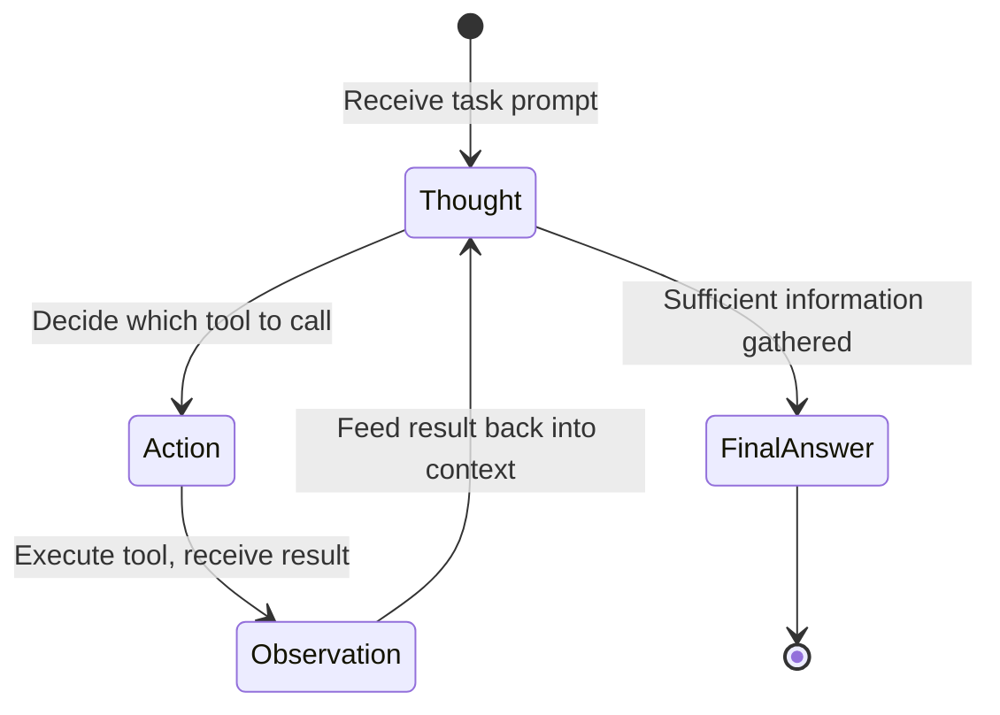

# Code Companion

This tutorial walks through `examples/code_companion/` — three developer-focused scripts that use a `native_react` (ReAct) agent to automate common coding tasks: reviewing pull request diffs, investigating errors, and generating tests. Each script adapts the same core pattern to a different workflow, making it easy to extend for your own code intelligence use cases.

!!! tip "Prerequisites"
    - Python 3.10 or later
    - OpenJarvis installed: `uv sync --extra dev` from the repository root
    - An inference engine running — Ollama locally or a cloud API key in `.env`
    - For `reviewer.py` and `code_review.py`: a git repository with at least two branches or commits

## The Three Scripts

| Script | Purpose | Tools Used |
|---|---|---|
| `reviewer.py` | Review a git diff between two branches | `git_diff`, `git_log`, `file_read`, `think` |
| `debugger.py` | Investigate an error and propose a fix | `file_read`, `shell_exec`, `think` |
| `test_gen.py` | Generate comprehensive tests for a Python module | `file_read`, `think`, `file_write` |

All three use the `native_react` agent with the same SDK pattern. The difference is which tools are provided and how the prompt is structured.

## The ReAct Agent Loop

The `native_react` agent implements the Thought-Action-Observation cycle. Rather than producing a single response, it iterates until it has gathered enough information:



This loop lets the agent adaptively explore the codebase. For example, the reviewer might read a diff, notice a suspicious function call, then read the source of that function before making its assessment — without any of that branching logic being hardcoded in the script.

## Core SDK Pattern

All three scripts follow the same structure. Understanding this pattern lets you adapt it to any code intelligence task:

```python title="Core SDK pattern" hl_lines="4 5 6"
from openjarvis import Jarvis

j = Jarvis(model="qwen3:8b", engine_key="ollama")  # (1)!
try:
    response = j.ask(
        prompt,                      # (2)!
        agent="native_react",        # (3)!
        tools=["git_diff", "think"], # (4)!
    )
    print(response)
finally:
    j.close()  # (5)!
```

1. Both `model` and `engine_key` are optional. Omitting them uses auto-detected defaults from `~/.openjarvis/config.toml`.
2. The prompt describes the task in detail, including what tools to use, what steps to follow, and what the output structure should look like.
3. `"native_react"` selects the `NativeReActAgent`. The alias `"react"` also works.
4. The tool list is passed directly. Any registered tool name is valid — run `jarvis agent info native_react` to see all available tools.
5. Always call `j.close()` to release engine resources. A `try/finally` block ensures cleanup even if the agent raises an exception.

## Code Review

The `reviewer.py` script reviews the diff between two git refs and produces structured feedback with issues, suggestions, and an overall verdict.

```bash title="Terminal"
# Review a feature branch against main (default)
python examples/code_companion/reviewer.py --branch feature-x

# Review a specific commit range
python examples/code_companion/reviewer.py --branch HEAD --base develop

# Use a cloud model for larger diffs
python examples/code_companion/reviewer.py \
    --branch feature-x --model gpt-4o --engine cloud
```

The agent follows a four-step process:

1. Call `git_diff` to see what changed between the two refs
2. Call `git_log` to understand the commit history and intent
3. Call `file_read` on any files that need more context
4. Call `think` to reason about code quality, bugs, and design decisions

The final output is structured with four sections: **Summary**, **Issues Found**, **Suggestions**, and **Overall Assessment** (APPROVE, REQUEST CHANGES, or COMMENT).

| Flag | Default | Description |
|---|---|---|
| `--branch` | `HEAD` | Branch or commit to review |
| `--base` | `main` | Base branch to diff against |
| `--model` | `qwen3:8b` | Model identifier |
| `--engine` | `ollama` | Engine backend |

## Debug Assistant

The `debugger.py` script takes an error message, optionally a file path, and produces a root cause analysis with a concrete fix.

```bash title="Terminal"
# Investigate a TypeError
python examples/code_companion/debugger.py \
    --error "TypeError: NoneType has no attribute 'split'"

# Provide the file where the error occurred for faster analysis
python examples/code_companion/debugger.py \
    --error "KeyError: 'user_id'" \
    --file src/app/views.py

# Use a cloud model for complex stack traces
python examples/code_companion/debugger.py \
    --error "Segfault in libfoo.so" \
    --model gpt-4o --engine cloud
```

The agent uses `file_read` to examine the relevant source, `shell_exec` to run diagnostic commands (grep for symbols, check imports, inspect directory contents), and `think` to reason about root causes before proposing a fix.

!!! note "shell_exec safety"
    The `shell_exec` tool runs commands in the current working directory. In production deployments, `ToolExecutor` enforces RBAC capability policies — ensure the `shell_exec` capability is permitted for the agent's role. See [Architecture: Security](../architecture/security.md).

The output has three sections: **Root Cause**, **Proposed Fix** (concrete code change), and **Prevention** (type hints, validation, tests).

| Flag | Default | Description |
|---|---|---|
| `--error` | (required) | Error message or stack trace |
| `--file` | (none) | Optional file path where the error occurred |
| `--model` | `qwen3:8b` | Model identifier |
| `--engine` | `ollama` | Engine backend |

## Test Generator

The `test_gen.py` script reads a Python module, reasons about its public interface, and writes a complete test file.

```bash title="Terminal"
# Generate pytest tests for a module
python examples/code_companion/test_gen.py \
    --module src/openjarvis/tools/calculator.py

# Use unittest and specify the output file
python examples/code_companion/test_gen.py \
    --module src/openjarvis/tools/calculator.py \
    --framework unittest \
    --output tests/test_calculator_generated.py
```

The agent reads the module with `file_read`, uses `think` to plan test cases (happy paths, edge cases, error handling, boundary conditions), reads any related base classes for context, then writes the complete test file with `file_write`.

!!! note "Output path default"
    If `--output` is not specified, the generated file is saved as `test_<module_name>.py` in the current working directory. The script prints the output path when done.

The generated tests follow these guidelines (enforced via the prompt):

- Every public function and method has at least one test
- Each test has a docstring explaining what it verifies
- Edge cases are covered: empty input, `None`, large values, invalid types
- External dependencies are mocked with `unittest.mock`
- The file is self-contained and runnable with `pytest` or `unittest` without modification

| Flag | Default | Description |
|---|---|---|
| `--module` | (required) | Path to the Python module |
| `--framework` | `pytest` | Test framework (`pytest` or `unittest`) |
| `--output` | `test_<name>.py` | Output file path |
| `--model` | `qwen3:8b` | Model identifier |
| `--engine` | `ollama` | Engine backend |

## Engine Selection

=== "Ollama (local)"

    ```bash title="Terminal"
    ollama serve
    ollama pull qwen3:8b
    python examples/code_companion/reviewer.py --branch feature-x
    ```

=== "Cloud API"

    ```bash title="Terminal"
    source .env  # load OPENAI_API_KEY or similar
    python examples/code_companion/reviewer.py \
        --branch feature-x \
        --model gpt-4o \
        --engine cloud
    ```

## Customization

### Change the tool set

Edit the `tools` list in any script to add or remove tools. For example, to let the reviewer also search the web for known security advisories related to dependencies it sees in the diff:

```python
tools = ["git_diff", "git_log", "file_read", "think", "web_search"]
```

### Adjust the prompt

Each script contains a `prompt` string that instructs the agent what to do and what to produce. Modify it to match your team's conventions — different review sections, specific coding standards, or a particular output format for downstream tooling.

### Add memory

For multi-session workflows (e.g., a reviewer that remembers previous assessments of the same files), add `"memory_store"` and `"memory_search"` to the tool list and update the prompt to use them:

```python
tools = ["git_diff", "git_log", "file_read", "think",
         "memory_store", "memory_search"]
```

## See Also

- [Architecture: Agents](../architecture/agents.md) — `NativeReActAgent` internals and the Thought-Action-Observation loop
- [Architecture: Tools and Memory](../architecture/memory.md) — git tools, file tools, shell tools, and the `ToolExecutor` dispatch pipeline
- [Architecture: Security](../architecture/security.md) — RBAC capability policies for `shell_exec` and other privileged tools
- [Tutorials: Deep Research Assistant](deep-research.md) — the same SDK pattern with the `OrchestratorAgent` and web/memory tools
