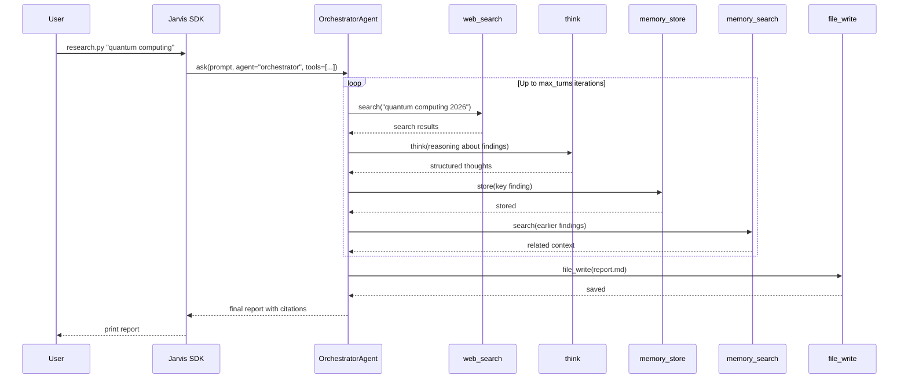

# Deep Research Assistant

This tutorial walks through `examples/deep_research/research.py` — a standalone script that uses an orchestrator agent to research a topic, gather sources across multiple tool-calling turns, and produce a cited report. It demonstrates how to compose web search, memory, and file output into a single coherent research workflow.

!!! tip "Prerequisites"
    - Python 3.10 or later
    - OpenJarvis installed: run `uv sync --extra dev` from the repository root
    - An inference engine running — either Ollama locally (see below) or a cloud API key in your `.env` file

## Quick Start

Run the research script from the repository root, passing your topic as a positional argument:

```bash title="Terminal"
python examples/deep_research/research.py "quantum computing advances 2026"
```

Save the report to a file:

```bash title="Terminal"
python examples/deep_research/research.py "quantum computing advances 2026" \
    --output report.md
```

Use a cloud model instead of a local engine:

```bash title="Terminal"
source .env  # load API keys
python examples/deep_research/research.py "climate policy trends" \
    --model gpt-4o --engine cloud --max-turns 20
```

## How It Works

The script creates a `Jarvis` instance and delegates the research task to an `OrchestratorAgent` with five tools wired in. The orchestrator iterates through multiple tool-calling turns, deciding at each step whether to search, store, think, or synthesize.



Each turn the orchestrator decides which tool to call based on what it has learned so far. The `think` tool lets the model reason without side effects, while `memory_store` and `memory_search` provide persistent scratch space across turns — so a finding from turn 3 can still inform the synthesis in turn 12.

## The Script

```python title="examples/deep_research/research.py" hl_lines="9 10 11 12 13"
from openjarvis import Jarvis

tools = ["web_search", "think", "file_write", "memory_store", "memory_search"]

j = Jarvis(model="qwen3:8b", engine_key="ollama")  # (1)!
try:
    response = j.ask(
        "Research the following topic in depth and produce a report:\n\nquantum computing",
        agent="orchestrator",     # (2)!
        tools=tools,              # (3)!
        system_prompt=...,        # (4)!
        max_turns=15,             # (5)!
        temperature=0.5,
    )
finally:
    j.close()
```

1. Creates a `Jarvis` instance targeting the local Ollama engine with `qwen3:8b`. Both parameters are optional — omitting them uses auto-detected defaults from `~/.openjarvis/config.toml`.
2. Selects the `OrchestratorAgent`, which runs a multi-turn tool-calling loop rather than a single round-trip.
3. The tool list is passed directly to the agent. All five tools are registered in the tool registry and need no further configuration.
4. The system prompt instructs the model to cite sources and distinguish facts from emerging claims.
5. The loop terminates after 15 tool-calling turns or when the agent decides it has enough information.

## Engine Configuration

=== "Ollama (local)"

    Start the Ollama daemon and pull the model before running the script:

    ```bash title="Terminal"
    ollama serve
    ollama pull qwen3:8b
    python examples/deep_research/research.py "your topic here"
    ```

    No flags needed — `--engine ollama` and `--model qwen3:8b` are the defaults.

=== "Cloud API"

    Set your API key in `.env`, then pass `--engine cloud` and the appropriate model identifier:

    ```bash title="Terminal"
    # .env (in the repository root, gitignored)
    OPENAI_API_KEY=sk-...

    source .env
    python examples/deep_research/research.py "your topic" \
        --model gpt-4o --engine cloud
    ```

=== "vLLM"

    If you are running a vLLM inference server (e.g., on a multi-GPU node):

    ```bash title="Terminal"
    python examples/deep_research/research.py "your topic" \
        --model meta-llama/Meta-Llama-3-8B-Instruct \
        --engine vllm
    ```

    Make sure `VLLM_BASE_URL` is set in `.env` pointing to your vLLM server.

## Configuration Reference

| Flag | Default | Description |
|---|---|---|
| `--model` | `qwen3:8b` | Model identifier passed to the engine |
| `--engine` | `ollama` | Engine backend (`ollama`, `cloud`, `vllm`, `llamacpp`, `mlx`) |
| `--max-turns` | `15` | Maximum orchestrator loop iterations |
| `--output` | (none) | File path to save the final report; if omitted, prints to stdout |

## Recipe-Driven Configuration

The companion `research.toml` in `examples/deep_research/` expresses the same setup declaratively. You can load it programmatically with `load_recipe()` and pass the result to `SystemBuilder`:

```python title="Using the recipe"
from openjarvis.recipes import load_recipe
from openjarvis import SystemBuilder

recipe = load_recipe("examples/deep_research/research.toml")
system = SystemBuilder(**recipe.to_builder_kwargs()).build()
response = system.ask("quantum computing advances 2026")
system.close()
```

This is useful when you want to version-control the research configuration, share it with collaborators, or feed it to the `jarvis eval` runner for benchmarking.

## Customization

### Swap the agent

Replace `"orchestrator"` with `"native_react"` for a Thought-Action-Observation loop, or `"native_openhands"` for a CodeAct-style agent that can write and execute code:

```python
response = j.ask(prompt, agent="native_react", tools=tools)
```

### Add more tools

Append any registered tool name to the `tools` list. For example, to also query a local knowledge base:

```python
tools = ["web_search", "think", "file_write",
         "memory_store", "memory_search", "knowledge_graph_query"]
```

Run `jarvis agent info orchestrator` to see the full tool catalog.

### Adjust temperature

Lower values (0.2) produce more focused, factual reports. Higher values (0.7-0.8) encourage broader exploration and more creative synthesis:

```bash title="Terminal"
python examples/deep_research/research.py "your topic" --max-turns 20
```

## See Also

- [Architecture: Agents](../architecture/agents.md) — agent hierarchy (`BaseAgent`, `ToolUsingAgent`, `OrchestratorAgent`) and the `accepts_tools` mechanism
- [Architecture: Tools and Memory](../architecture/memory.md) — tool registry, MCP adapter, and the `ToolExecutor` dispatch pipeline
- [Getting Started: Configuration](../getting-started/configuration.md) — how to configure engines and models in `~/.openjarvis/config.toml`
