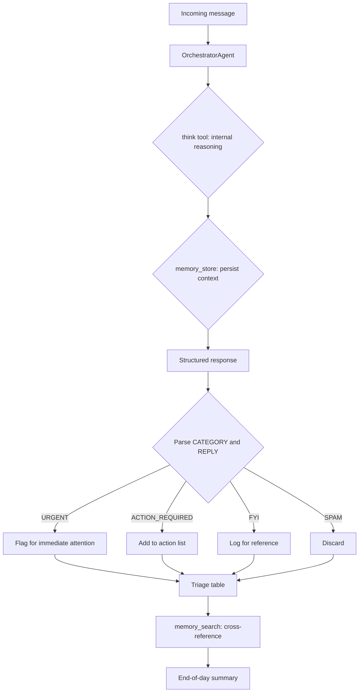

# Messaging Hub

This tutorial walks through `examples/messaging_hub/smart_inbox.py` — a script that connects OpenJarvis to messaging platforms, triages incoming messages by priority, drafts context-aware replies, and produces end-of-day summaries. It demonstrates channel integration, structured agent output, and memory-backed aggregation across multiple messages.

!!! tip "Prerequisites"
    - Python 3.10 or later
    - OpenJarvis installed: `uv sync --extra dev` from the repository root
    - An inference engine running (Ollama with `qwen3:8b` pulled, or cloud API keys)
    - For live channel mode: channel-specific credentials (see [Setting Up Real Channels](#setting-up-real-channels))

## Quick Start: Demo Mode

Demo mode processes five sample messages with no channel setup or credentials required. It is the fastest way to see the triage pipeline in action:

```bash title="Terminal"
python examples/messaging_hub/smart_inbox.py --demo
```

Expected output (abbreviated):

```
Smart Inbox — Demo Mode
Model: qwen3:8b  |  Engine: ollama
============================================================
Processing 5 messages...

  [1/5] Classifying: URGENT: Server is down in production...
           -> URGENT
  [2/5] Classifying: Hey, just wanted to share this interest...
           -> FYI
  [3/5] Classifying: Can you review my PR #42 by end of day...
           -> ACTION_REQUIRED
  [4/5] Classifying: Meeting reminder: Team standup at 10am...
           -> FYI
  [5/5] Classifying: Buy now! Limited time offer on premium...
           -> SPAM

  #   Category          Message                             Reply
  ---------------------------------------------------------------
  1   URGENT            URGENT: Server is down...           On it — escalating now.
  2   FYI               Hey, just wanted to share...        Thanks for sharing!
  3   ACTION_REQUIRED   Can you review my PR #42...         Will review before EOD.
  4   FYI               Meeting reminder: Team standup...   N/A
  5   SPAM              Buy now! Limited time offer...      N/A

Generating end-of-day summary...
```

Override the model or engine:

```bash title="Terminal"
python examples/messaging_hub/smart_inbox.py --demo --model gpt-4o --engine cloud
```

## How Message Classification Works

Each incoming message goes through a structured prompt that asks the agent to output exactly two fields — a category and a reply — in a parseable format. The script then extracts those fields and builds a triage table.



After all messages are processed, a second orchestrator call uses `memory_search` to retrieve the stored triage log and produces a grouped summary with open action items highlighted.

## The Classification Prompt

The agent receives a structured prompt that specifies the output format exactly. This makes the response reliably parseable without a complex schema:

```python title="examples/messaging_hub/smart_inbox.py"
CLASSIFICATION_PROMPT = (
    "You are a smart inbox assistant. Classify the following message into "
    "exactly one category: URGENT, ACTION_REQUIRED, FYI, or SPAM.\n"
    "Then draft a short reply if appropriate (not for SPAM).\n\n"
    "Respond in this exact format:\n"
    "CATEGORY: <category>\n"
    "REPLY: <reply or N/A>\n\n"
    "Message:\n{message}"
)
```

The `think` tool lets the agent reason internally before committing to a category, and `memory_store` persists each classification so the summary prompt can reference the full triage log.

## Setting Up Real Channels

=== "Slack"

    1. Add the Slack MCP server to your configuration:

        ```bash title="Terminal"
        jarvis add slack
        ```

    2. Set your credentials in `.env` (gitignored):

        ```bash title=".env"
        SLACK_BOT_TOKEN=xoxb-...
        SLACK_APP_TOKEN=xapp-...
        ```

    3. Invite the bot to the target Slack channel in the Slack workspace settings.

    4. Run the script in live channel mode:

        ```bash title="Terminal"
        python examples/messaging_hub/smart_inbox.py --channel slack
        ```

=== "WhatsApp"

    1. Ensure Node.js 22 or later is installed.

    2. Configure the WhatsApp Baileys bridge. See the [channel documentation](../architecture/overview.md) for full setup steps.

    3. Start the bridge — it will print a QR code. Scan it with the WhatsApp mobile app to authenticate.

    4. Run the script:

        ```bash title="Terminal"
        python examples/messaging_hub/smart_inbox.py --channel whatsapp
        ```

=== "Other Channels"

    OpenJarvis supports LINE, Viber, Mastodon, Rocket.Chat, Zulip, XMPP, Twitch, Nostr, and more. List all available channels:

    ```bash title="Terminal"
    jarvis channel list
    jarvis channel status
    ```

    Each channel requires its own environment variables. Run `jarvis add <channel>` where available to auto-generate the configuration template.

!!! warning "Live channel mode"
    Live channel mode requires channel credentials and the corresponding channel subsystem to be running. Use `--demo` to verify the triage logic before connecting to a real channel.

## Channel Configuration via TOML

The `messaging.toml` recipe in `examples/messaging_hub/` captures the agent and channel defaults declaratively:

```toml title="examples/messaging_hub/messaging.toml"
[channel]
default = "slack"

[agent]
type = "orchestrator"
max_turns = 5
temperature = 0.3
tools = ["think", "memory_store", "memory_search"]
```

You can load this recipe programmatically:

```python title="Loading the messaging recipe"
from openjarvis.recipes import load_recipe
from openjarvis import SystemBuilder

recipe = load_recipe("examples/messaging_hub/messaging.toml")
system = SystemBuilder(**recipe.to_builder_kwargs()).build()
response = system.ask(CLASSIFICATION_PROMPT.format(message=incoming_message))
system.close()
```

## Adding Custom Triage Rules

Extend the classification categories by editing `CLASSIFICATION_PROMPT`. For example, to add a `FOLLOW_UP` category for messages that need a response within 48 hours:

```python title="Custom classification prompt" hl_lines="2"
CLASSIFICATION_PROMPT = (
    "Classify into: URGENT, ACTION_REQUIRED, FOLLOW_UP, FYI, or SPAM.\n"
    "Then draft a short reply if appropriate (not for SPAM).\n\n"
    "Respond in this exact format:\n"
    "CATEGORY: <category>\n"
    "REPLY: <reply or N/A>\n\n"
    "Message:\n{message}"
)
```

You can also add domain rules in the system prompt via `messaging.toml` — for instance, routing any message containing "P0" or "incident" directly to URGENT regardless of phrasing.

## Scheduling the Daily Summary

After processing all messages, the end-of-day summary call runs immediately in the script. For production use, schedule it independently via the OpenJarvis scheduler:

```bash title="Terminal"
jarvis scheduler create "Daily inbox summary" \
    --type cron --value "0 17 * * *"
```

Or use the operator recipe pattern to run a persistent triage agent on a schedule. See the operator recipes in `src/openjarvis/recipes/data/operators/` for ready-made examples.

## See Also

- [Architecture: Agents](../architecture/agents.md) — `OrchestratorAgent` and the multi-turn tool loop
- [Architecture: Tools and Memory](../architecture/memory.md) — `memory_store`, `memory_search`, and the storage backends
- [Tutorials: Scheduled Personal Ops](scheduled-ops.md) — combining scripts with the cron scheduler
