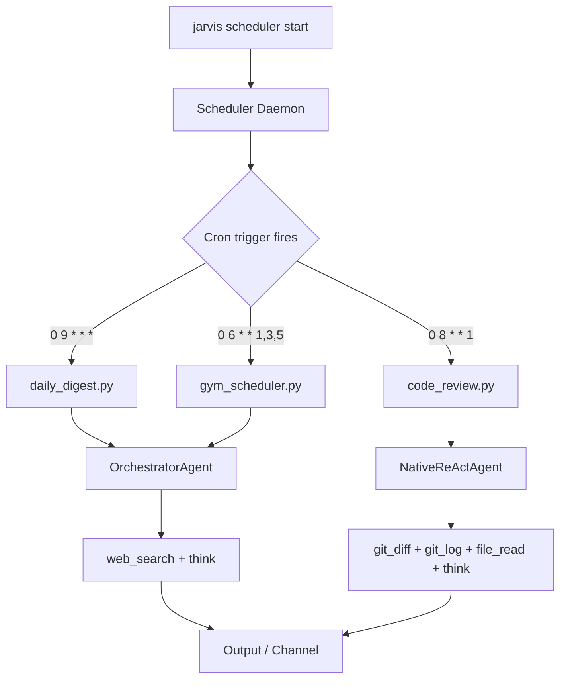

# Scheduled Personal Ops

This tutorial walks through `examples/scheduled_ops/` — three scripts that run autonomous agents on cron-like schedules to handle recurring personal tasks. Together they demonstrate how to combine the `Jarvis` SDK, the scheduler CLI, and the Python `TaskScheduler` API to build a personal operations layer that runs in the background.

!!! tip "Prerequisites"
    - Python 3.10 or later
    - OpenJarvis installed: `uv sync --extra dev` from the repository root
    - An inference engine running (Ollama with `qwen3:8b` pulled, or a cloud API key)
    - For full cron expression support, install `croniter`: `uv add croniter`

## The Three Scripts

| Script | Agent | Tools | Default Schedule | Purpose |
|---|---|---|---|---|
| `daily_digest.py` | `orchestrator` | `web_search`, `think` | Daily 9:00 AM | Search and summarize top news for chosen topics |
| `code_review.py` | `native_react` | `git_log`, `git_diff`, `file_read`, `think` | Monday 8:00 AM | Review the past week of commits in a repository |
| `gym_scheduler.py` | `orchestrator` | `web_search`, `think` | MWF 6:00 AM | Check gym hours and class availability |

Each script follows the same SDK pattern: create a `Jarvis` instance, call `j.ask()` with an agent and tools, print the result, and close the instance. The schedule is managed externally by the OpenJarvis scheduler daemon.

## Quick Start: Run Scripts Manually

Test each script without a running scheduler by invoking it directly:

```bash title="Terminal"
# Morning news digest for AI and robotics
uv run python examples/scheduled_ops/daily_digest.py --topics "AI,robotics"

# Code review for the current repository (last 7 days of commits)
uv run python examples/scheduled_ops/code_review.py --repo-path .

# Gym schedule check
uv run python examples/scheduled_ops/gym_scheduler.py --gym "24 Hour Fitness"
```

All scripts accept `--model` and `--engine` flags:

```bash title="Terminal"
uv run python examples/scheduled_ops/daily_digest.py \
    --model qwen3:8b --engine ollama --topics "AI,finance"
```

## How the Scheduler Works



The scheduler daemon reads registered tasks from SQLite, fires them at the correct time, and passes the configured prompt to the agent. Each script can also be run directly — the scheduler is only needed for recurring, unattended operation.

## Set Up Schedules with the CLI

Register each script as a recurring task using `jarvis scheduler create`:

```bash title="Terminal"
# Morning digest every day at 9 AM
jarvis scheduler create "Run daily news digest" \
    --type cron --value "0 9 * * *"

# Weekly code review every Monday at 8 AM
jarvis scheduler create "Run weekly code review" \
    --type cron --value "0 8 * * 1"

# Gym check on Monday, Wednesday, Friday at 6 AM
jarvis scheduler create "Check gym schedule" \
    --type cron --value "0 6 * * 1,3,5"
```

Then start the scheduler daemon in the foreground (or as a background service):

```bash title="Terminal"
jarvis scheduler start
```

List registered tasks at any time:

```bash title="Terminal"
jarvis scheduler list
```

!!! note "Cron expression syntax"
    OpenJarvis uses standard five-field cron syntax: `minute hour day-of-month month day-of-week`. Install `croniter` (`uv add croniter`) for full expression support including ranges and step values. Without it, basic `hour:minute` patterns still work.

## Configure Schedules with TOML

The `schedules.toml` file in `examples/scheduled_ops/` defines all three schedules declaratively. This is convenient for version-controlling your personal ops configuration or sharing it across machines:

```toml title="examples/scheduled_ops/schedules.toml"
[schedules.daily_digest]
type = "cron"
value = "0 9 * * *"
description = "Morning news and social media digest"
script = "daily_digest.py"

[schedules.code_review]
type = "cron"
value = "0 8 * * 1"
description = "Weekly code review"
script = "code_review.py"

[schedules.gym_scheduler]
type = "cron"
value = "0 6 * * 1,3,5"
description = "Gym hours and class check"
script = "gym_scheduler.py"
```

Point your own tooling or a custom loader at this file to register tasks in bulk.

## Register Tasks via the Python API

The `gym_scheduler.py` script includes a `--register` flag that demonstrates programmatic task registration using `TaskScheduler` directly:

```bash title="Terminal"
uv run python examples/scheduled_ops/gym_scheduler.py \
    --register --gym "Planet Fitness"
```

The equivalent Python code:

```python title="Programmatic task registration"
from openjarvis.scheduler import TaskScheduler
from openjarvis.scheduler.store import SchedulerStore

store = SchedulerStore()
scheduler = TaskScheduler(store)

task = scheduler.create_task(  # (1)!
    prompt="Check gym schedule for 'Planet Fitness'",
    schedule_type="cron",
    schedule_value="0 6 * * 1,3,5",
    agent="orchestrator",
    tools="web_search,think",
)
print(f"Task registered: {task.id}")
print(f"Next run:        {task.next_run}")
```

1. `create_task()` persists the task to SQLite and computes the next trigger time. The scheduler daemon picks it up without a restart.

## The Daily Digest Script

The digest script is the simplest of the three. It builds a date-stamped prompt and passes it to an orchestrator with `web_search` and `think`:

```python title="examples/scheduled_ops/daily_digest.py" hl_lines="5 6 7 8"
from openjarvis import Jarvis

j = Jarvis()  # uses defaults from ~/.openjarvis/config.toml
response = j.ask(
    f"Today is {today}. Search and summarize the top news on: {topics}",
    agent="orchestrator",
    tools=["web_search", "think"],
)
j.close()
```

The orchestrator searches for each topic in a separate turn, uses `think` to synthesize across topics, and returns a structured digest with bullet-point summaries and a one-paragraph outlook.

## Send Results to a Channel

To route script output to Slack or any other supported channel, pipe stdout through `jarvis channel send`:

```bash title="Terminal"
uv run python examples/scheduled_ops/daily_digest.py \
    --topics "AI,finance" | jarvis channel send slack
```

Or add channel output inside the script:

```python title="In-script channel output"
from openjarvis.channels import ChannelRegistry

channel = ChannelRegistry.create("slack", webhook_url="https://hooks.slack.com/...")
channel.send(response)
```

List all available channels:

```bash title="Terminal"
jarvis channel list
```

!!! warning "Channel credentials"
    Live channel output requires channel-specific credentials. Run `jarvis add slack` (or the relevant provider) to set up the MCP server and credential store, then configure environment variables in your `.env` file before starting the scheduler daemon.

## Customization Tips

- **Change topics**: Pass `--topics "finance,healthcare,sports"` to `daily_digest.py` for a different digest.
- **Review window**: Pass `--days 14` to `code_review.py` for a two-week review cycle instead of one week.
- **Swap agents**: Replace `orchestrator` with `native_react` in any script to compare agent behavior on the same task.
- **Add file output**: Append `"file_write"` to the `tools` list and update the prompt to save reports to disk instead of printing them.
- **One-time tasks**: Use `--type once --value "2026-04-01T09:00:00"` with `jarvis scheduler create` for non-recurring tasks.

## See Also

- [Architecture: Agents](../architecture/agents.md) — `OrchestratorAgent` and `NativeReActAgent` internals
- [Architecture: Tools and Memory](../architecture/memory.md) — tool registry and `ToolExecutor`
- [Getting Started: Configuration](../getting-started/configuration.md) — engine and model defaults
